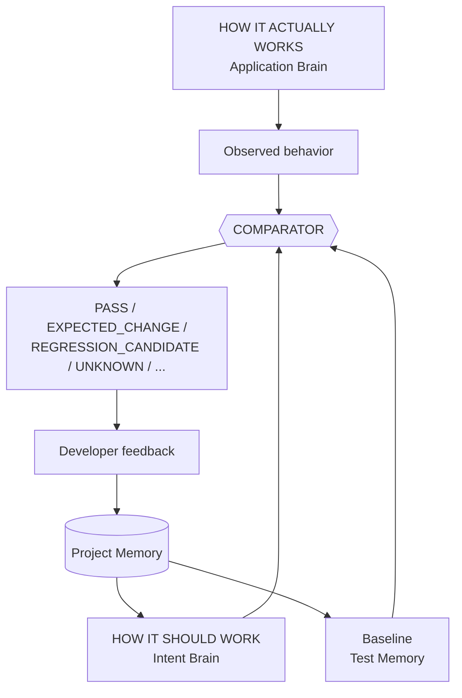
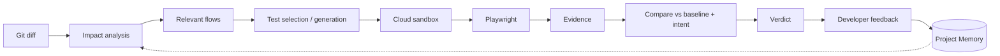

# 00 — Product Vision

**Purpose:** Define what the product is, what it is not, and how success is measured.
**Related:** [01-problem-statement](./01-problem-statement.md), [26-mvp](./26-mvp.md), [30-architecture-review](./30-architecture-review.md)

## 1. Vision statement

A cloud-hosted autonomous QA engineer that works alongside developers. On every configured trigger (PR/MR, push, schedule, manual) it:

1. Knows how the application currently works (**Application Brain**).
2. Knows what changed in the code (**Git analysis**).
3. Knows which modules, APIs and user flows are affected (**Change Impact**).
4. Knows what the application is supposed to do, and how sure it is (**Intent Brain**).
5. Selects or generates the right tests and runs them deterministically in an isolated cloud sandbox (**Playwright Engine**).
6. Compares observed behavior against baseline and intent, and reports evidence-backed verdicts (**Comparator**).
7. Asks the developer when intent is unknown, and remembers the answer (**Test Memory / Decisions**).

## 2. What the product is NOT

- Not a generic "AI browser agent" that clicks around randomly.
- Not a replacement for developer judgement — the developer is the final authority on intent.
- Not a production monitoring or synthetic-monitoring tool (MVP never tests production).
- Not a code-modification tool — it proposes, never silently changes tests or code.

## 3. North star

Note the addition of **Baseline** as a third comparator input: detecting that behavior *changed* requires a known prior observation, which the brief implied but did not define.

Core development loop:

Metaphor (from the brief, retained):
Playwright = eyes and hands · Static analysis = map · Runtime tracing = observation · Git = change detector · Application Brain = memory of how it works · Intent Brain = specification of how it should work · AI = reasoning layer · Execution plane = safe lab · Developer = final authority.

## 4. Architectural principles

Retained from the brief, grouped and sharpened. Every design doc must be consistent with these.

**Trust & correctness**
1. Optimize for developer trust over autonomy. False positives are a first-class product risk.
2. A behavior difference is a *Behavior Change*, never automatically a bug.
3. Unknown intent stays `UNKNOWN` until resolved by evidence or a developer.
4. Every automated conclusion carries evidence and a confidence level.
5. The platform never emits "bug" — the strongest automatic verdict is `REGRESSION_CANDIDATE`.

**Determinism & AI**
6. Deterministic execution over uncontrolled AI behavior; AI emits structured actions that are validated before execution.
7. AI is a reasoning layer (planning, interpretation, diagnosis), not the test engine.
8. AI providers are pluggable; no single-vendor lock-in.

**Isolation & safety**
9. The Control Plane never executes repository code. Static parsing happens in a sandboxed Analysis Tier; building/running happens in the Execution Plane.
10. Execution sandboxes are ephemeral, per-run, and tenant-isolated.
11. Dangerous actions (payments, deletes, real email) are blocked by policy, not by AI discretion.
12. Secrets never reach AI models by default.

**Efficiency & adoption**
13. Change impact minimizes unnecessary testing; full runs remain available.
14. Project knowledge persists and evolves; new and existing projects share one architecture (initial sync = incremental sync from empty).
15. Incremental adoption: a project gets value from day one by running its *existing* tests, before any generation or exploration.
16. Components are modular and replaceable; CI/CD and Git providers are plugins.
17. Runs are reproducible where practical: exact commit, pinned images, recorded config, recorded seeds.

## 5. Success metrics

Metrics are split into **product trust**, **effectiveness**, **efficiency**, and **platform health**. Initial targets are hypotheses to be baselined during the design-partner period (see [04-non-functional-requirements](./04-non-functional-requirements.md)).

| Metric | Definition | Why it matters | How measured |
|---|---|---|---|
| **False-positive rate** ★ | `REGRESSION_CANDIDATE` verdicts later resolved `FALSE_POSITIVE` ÷ all resolved `REGRESSION_CANDIDATE` | Primary trust metric | Developer resolutions; unresolved excluded but tracked |
| **Resolution rate** | Verdicts needing input that receive a developer resolution within 7 days | Low rate = noise or low engagement | Resolution events |
| **Regression catch rate** | Confirmed regressions caught pre-merge ÷ (caught pre-merge + reported post-merge) | Effectiveness | Requires post-merge bug reporting link (manual tagging in MVP) |
| **Run completion rate** | Triggered runs reaching a terminal verdict (not `INFRA_FAILURE`/timeout) | Reliability | Run state |
| **Time to first feedback** | Trigger → first PR status update with verdict | Developer experience | Timestamps |
| **Median/P90 run duration** | Queue + setup + execution + analysis, split by stage | Where time goes | Stage timestamps |
| **Test selection efficiency** | Tests run in Smart mode ÷ tests in Full suite, *paired with* catch-rate so reductions don't hide misses | Cost vs. safety | Plan vs. suite size; periodic "shadow full run" comparison |
| **Selection recall** | In shadow full runs: failures in tests that Smart mode would have skipped ÷ all failures | Detects under-selection | Scheduled shadow runs |
| **Changed-module coverage** | Changed modules with ≥1 executed test ÷ changed modules | Impact coverage | Impact set vs. plan |
| **Flaky rate** | Tests classified `FLAKY` ÷ tests executed (30-day window) | Suite health | Test Memory |
| **Mean time to diagnose** | Verdict posted → developer resolution | Evidence quality | Resolution timestamps |
| **AI cost per run** | Tokens × price per run, by task type | Unit economics | AI gateway metering |
| **Infra cost per run** | Sandbox-minutes × rate + artifact storage | Unit economics | Cloud billing tags |
| **Evidence availability** | Failed/changed verdicts with complete evidence bundle ÷ total | Explainability | Evidence manifest checks |
| **Environment startup success** | Sandboxes reaching healthy state ÷ attempted | Onboarding friction | Health-check outcomes |

★ = headline metric. A reduction in tests run is only a win if selection recall holds.
