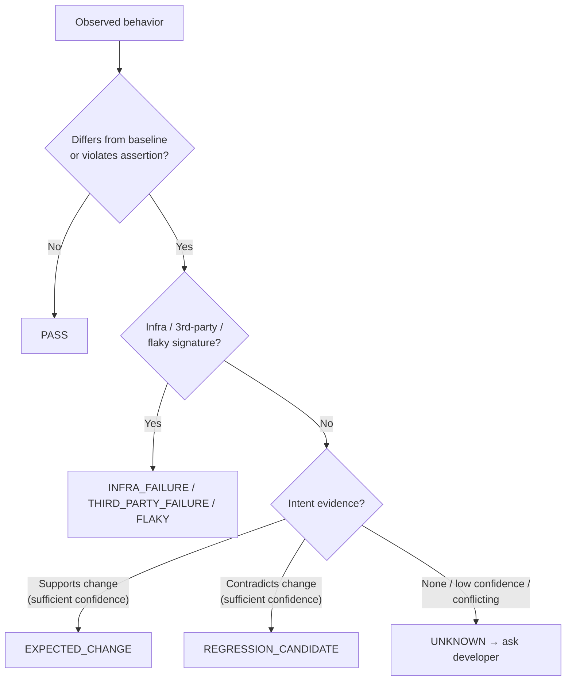

# 01 — Problem Statement

**Purpose:** State the problem the platform solves and the hard sub-problems it must address.
**Related:** [00-product-vision](./00-product-vision.md), [09-intent-brain](./09-intent-brain.md), [28-risks-and-challenges](./28-risks-and-challenges.md)

## 1. The problem

Development teams ship changes faster than they can verify them.

| Symptom | Consequence |
|---|---|
| E2E suites are slow, so teams run them nightly or not at all | Regressions are found after merge, when they are more expensive |
| E2E suites are brittle; locator changes break tests | Teams stop trusting red builds and ignore them |
| Tests are written for the flows someone remembered | Changed code often has no covering E2E test |
| Test failures say "TimeoutError" with no context | Diagnosis takes longer than the fix |
| QA knowledge lives in people's heads | Knowledge is lost; new team members repeat mistakes |
| AI browser agents exist but act randomly and hallucinate "bugs" | High false-positive rates destroy trust faster than no tool |

## 2. Why existing approaches fall short

| Approach | Gap |
|---|---|
| Hand-written Playwright/Cypress suites | Coverage gaps, maintenance burden, no change awareness, no intent model |
| Test impact analysis (unit-level, coverage-based) | Rarely extends to E2E/user-flow level; needs instrumented coverage runs |
| Record-and-replay / codeless tools | Brittle; no understanding of code or intent |
| Visual regression SaaS | Detects pixel change but not whether change is intended |
| Autonomous LLM browser agents | Non-deterministic, expensive per action, no source-code grounding, no memory, over-reports |

The missing piece is the **combination**: code-grounded impact analysis + deterministic runtime verification + an explicit, persistent model of intended behavior + a developer feedback loop.

## 3. The oracle problem (central difficulty)

A test oracle decides whether an observed behavior is correct. Code alone cannot be an oracle: if the booking flow changes from `Date → Participants` to `Participants → Date`, the code tells us *what* changed, not whether it *should* have.

Possible explanations for any behavior change: intentional feature, changed requirement, UX improvement, product decision, developer mistake, outdated test, unknown.

**Consequence for the design:** the platform needs three distinct inputs to a verdict:

1. **Observation** — what happened this run.
2. **Baseline** — what happened last time it was accepted.
3. **Intent** — what is supposed to happen, with source and confidence.

And it needs a principled way to say **"I don't know — please confirm"** without that becoming noise.

The brief's version of this tree omitted the noise-classification step (infra / third-party / flaky). It must come *before* intent comparison, otherwise an outage is compared against intent and reported as a regression.

## 4. Hard sub-problems

Detailed analysis lives in [28-risks-and-challenges](./28-risks-and-challenges.md). The ones that shape the architecture most:

1. **Intent capture** — most teams have poor written requirements. The Intent Brain must work with thin, noisy sources and grow from developer confirmations.
2. **Getting the app running** — cloud-starting an arbitrary repo (services, DB, seeds, env vars) is the single largest onboarding risk.
3. **Linking UI to code** — mapping a UI flow to backend symbols needs both static analysis and runtime correlation.
4. **State explosion** — autonomous exploration must be bounded and deduplicated.
5. **Noise** — flakiness, third-party failures and infra failures must be separated from application behavior.
6. **Safety** — untrusted code execution and destructive actions must be contained.
7. **Cost** — AI and browser minutes must scale sub-linearly with project size through impact selection and caching.

## 5. Target users

- **Primary:** Product engineering teams (5–100 engineers) building TypeScript/JavaScript web applications with a PR-based workflow.
- **Secondary:** Engineering managers / QA leads who want visibility of regression risk.
- **Not targeted in MVP:** Native mobile, desktop apps, non-web backends without UI, highly regulated on-prem-only environments.

## 6. Problem boundaries

In scope: development-time and CI-time verification of web applications in non-production environments.
Out of scope: production monitoring, load/performance testing, penetration testing (security *tests* for authz are in scope; offensive security scanning is not), automatic bug fixing.
