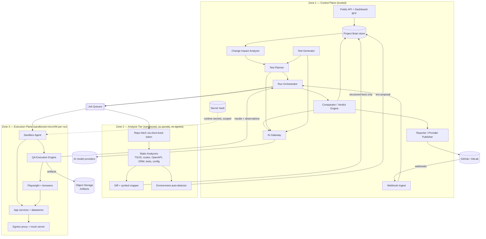
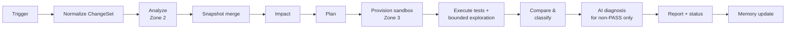

# 05 — System Architecture

**Purpose:** Define the logical architecture: tiers, components, responsibilities, trust boundaries, and key interfaces.
**Related:** [06-deployment-architecture](./06-deployment-architecture.md), [07-domain-model](./07-domain-model.md), [17-cloud-execution](./17-cloud-execution.md), [19-security-and-safety](./19-security-and-safety.md)

## 1. Architectural drivers

| Driver | Architectural consequence |
|---|---|
| Untrusted customer code | Three trust zones; the Control Plane never clones-and-runs, never parses in-process |
| False positives are fatal | Verdict pipeline is deterministic-first; AI output is advisory and gated by evidence rules |
| AI cost and non-determinism | AI is behind a gateway with budgets, caching, and structured I/O; never in the per-action hot loop |
| Diverse project stacks | Pluggable analyzers (per language/framework) and pluggable environment strategies |
| CI-triggered, bursty load | Asynchronous job pipeline with queues; stateless workers; per-tenant concurrency limits |
| Knowledge must persist | Project Brain as a versioned store, not a cache |
| Incremental adoption | Value path that works with zero AI and zero generated tests: run existing tests, report evidence |

## 2. Trust zones (key change from the brief)

The brief put "Git/Repository Analyzer" in the control plane flow while also requiring that the control plane never run untrusted code. Parsing untrusted source is itself a risk (parser exploits, zip bombs, symlink attacks, malicious `tsconfig`/babel plugins that execute on load). So the architecture has **three** zones:



**Zone rules**

| Rule | Zone 1 | Zone 2 | Zone 3 |
|---|---|---|---|
| Executes repository code | Never | Never (parse only, no build scripts, no package install) | Yes |
| Holds project secrets | Vault only | Never | Only the scoped secrets for its run, injected at start |
| Network egress | Normal | Git provider only (clone), via allow-list | App-defined allow-list via egress proxy; default deny |
| Talks to AI providers | Via AI Gateway | Never | Never (AI decisions go through Zone 1) |
| Lifetime | Long-lived | Per job, ephemeral container (gVisor-class sandbox) | Per run, ephemeral microVM |
| Output | — | JSON facts (validated against schema), size-capped | Results, observations, artifacts (validated, size-capped, redacted) |

Zone 2 outputs are treated as **untrusted data** by Zone 1: schema-validated, size-limited, and never interpreted as code or templates.

## 3. Component responsibilities

### Zone 1 — Control Plane

| Component | Responsibility | Key interfaces |
|---|---|---|
| **Public API / BFF** | AuthN/AuthZ, projects, config, results, resolutions, evidence URLs | REST ([23-api-contract](./23-api-contract.md)) |
| **Webhook Ingest** | Verify signatures, dedupe by delivery ID, normalize to `ChangeSet`, evaluate TriggerRules | `GitProvider.parseWebhook()` |
| **Git Provider Adapters** | GitHub, GitLab behind `GitProvider` interface: tokens, diff metadata, statuses/checks, comments | [16-ci-cd-integration](./16-ci-cd-integration.md) |
| **Run Orchestrator** | Owns the Run state machine; enqueues stage jobs; enforces budgets, concurrency, supersession, timeouts | Queue producer/consumer |
| **Project Brain Service** | Read/write API over Application Brain, Intent Brain, Test Memory; snapshot merge | Internal service API |
| **Change Impact Analyzer** | Changed symbols → graph traversal → scored impact set (deterministic) | [12-change-impact-analysis](./12-change-impact-analysis.md) |
| **Test Planner** | Build Test Plan from impact set + mode + history + budget; AI-assisted prioritization optional | [13-test-generation](./13-test-generation.md) |
| **Test Generator** | Generate DSL tests for uncovered impacted flows (AI-assisted, validated) | [13-test-generation](./13-test-generation.md) |
| **Exploration Controller** | Drives runtime exploration via structured actions to the Execution Engine; decides next action (heuristic first, AI for semantics) | [11-runtime-exploration](./11-runtime-exploration.md) |
| **Comparator / Verdict Engine** | Observation vs Baseline vs Intent → BehaviorChanges → verdicts (deterministic rules + AI-assisted diagnosis) | [09-intent-brain](./09-intent-brain.md), [20-test-memory](./20-test-memory.md) |
| **AI Gateway** | Provider abstraction, model routing by task tier, prompt templates, redaction, budget metering, caching, structured output validation | [15-ai-agent-architecture](./15-ai-agent-architecture.md) |
| **Reporter** | Report assembly, PR/MR status + comment, dashboard notifications | [18-evidence-and-reporting](./18-evidence-and-reporting.md) |
| **Secret Vault** | Encrypted secrets; issues per-run scoped, short-lived secret bundles | [19-security-and-safety](./19-security-and-safety.md) |
| **Audit Log** | Append-only record of config changes, secret access, resolutions, policy overrides | [19-security-and-safety](./19-security-and-safety.md) |

### Zone 2 — Analysis Tier

| Component | Responsibility |
|---|---|
| **Repo Fetcher** | Shallow/partial clone at exact SHA(s) using a short-lived, read-only installation token; enforce size limits |
| **Static Analyzers** | Pluggable per ecosystem. MVP: TypeScript/JavaScript (tree-sitter + TS compiler API in no-emit, no-plugin mode), Next.js/React Router route extraction, Express/NestJS/Next API route extraction, OpenAPI parsing, Prisma/Mongoose/TypeORM model extraction, Playwright/Cypress test discovery, `package.json`/Docker/compose/CI config parsing |
| **Diff & Symbol Mapper** | `git diff base...head` → changed hunks → enclosing symbols → graph node keys |
| **Environment Auto-Detector** | Propose an EnvironmentProfile from compose files, package scripts, Dockerfiles, CI config, READMEs |

### Zone 3 — Execution Plane

| Component | Responsibility |
|---|---|
| **Sandbox Agent** | Bootstraps the microVM: checkout, inject scoped secrets, build, start services, datastores, health checks, hooks; enforces TTL; streams logs |
| **QA Execution Engine** | Validates DSL actions against ActionPolicy, compiles to Playwright calls, runs imported Playwright specs, captures evidence, emits Observations; exposes an action channel for exploration | 
| **Playwright + Browsers** | Deterministic browser automation, tracing, HAR, screenshots, video |
| **Egress Proxy & Mock Server** | Default-deny outbound; allow-list per project; route configured third-party hosts to sandbox endpoints, mocks, or recorded responses; label every outbound call for third-party failure attribution |

## 4. Run pipeline (logical)



Stages are separate queue jobs so each can be retried, timed, and scaled independently. Analysis and provisioning can overlap: the orchestrator may start provisioning as soon as analysis confirms the commit is buildable, since the plan is only needed at execution start.

## 5. Key internal interfaces

```ts
// Git provider abstraction (Zone 1)
interface GitProvider {
  verifyWebhook(headers, rawBody): boolean;
  parseWebhook(headers, body): ChangeSetDraft | null;
  getChangedFiles(repo, baseSha, headSha): ChangedFile[];
  issueCloneToken(repo, ttlSeconds): ShortLivedToken; // read-only
  setStatus(repo, sha, status: CommitStatus): void;
  upsertComment(repo, prNumber, marker, markdown): void;
}

// Analyzer plugin (Zone 2)
interface AnalyzerPlugin {
  id: string; version: string;
  detect(repoTree: FileTree): boolean;
  analyze(ctx: { files: FileAccessor; changedFiles?: string[] }): AnalyzerFacts; // nodes, edges, tests, envHints
}

// Execution action (Zone 1 -> Zone 3), see 14-playwright-engine
type Action =
  | { action: 'goto'; url: string }
  | { action: 'click' | 'hover' | 'check'; target: Locator }
  | { action: 'fill'; target: Locator; value: ValueRef }
  | { action: 'select'; target: Locator; option: string }
  | { action: 'press'; key: string; target?: Locator }
  | { action: 'wait_for'; condition: WaitCondition }
  | { action: 'assert'; assertion: Assertion };

// AI gateway (Zone 1)
interface AIGateway {
  run<T>(task: AITaskType, input: RedactedInput, schema: JSONSchema<T>, budget: Budget): Promise<AIResult<T>>;
}
```

## 6. Cross-cutting concerns

| Concern | Approach |
|---|---|
| **Tenancy** | `orgId` + `projectId` on every row; enforced in repository layer (and DB row-level security if Postgres chosen) |
| **Idempotency** | Webhook delivery IDs; stage jobs keyed `(runId, stage, attempt)` |
| **Configuration versioning** | EnvironmentProfile, ActionPolicy, analyzer versions all recorded on Run |
| **Observability** | OpenTelemetry traces across stages; metrics per stage; AI metering per task; see [04-non-functional-requirements](./04-non-functional-requirements.md) |
| **Failure isolation** | A failing analyzer plugin degrades the snapshot (marked partial) rather than failing the run; the planner widens selection when graph is partial |
| **Degraded modes** | AI unavailable → deterministic verdicts only, AI diagnosis marked "unavailable"; Brain partial → fall back to Full or "affected application" selection |

## 7. Technology evaluation

The brief lists candidates; evaluation below. Items marked ⚑ require approval. The proposed stack is in [31-tech-stack](./31-tech-stack.md): a $50/month early-stage stack (single VPS, pg-boss, rented per-run microVMs) that departs from this table, and a funded scale-up target that largely matches it.

| Concern | Candidate | Recommendation | Reasoning |
|---|---|---|---|
| Language | Node.js + TypeScript | **Adopt** | Same ecosystem as Playwright and the MVP target stacks; TS compiler API available for analysis |
| Browser automation | Playwright | **Adopt** | Tracing, a11y snapshots, network interception, multi-browser |
| Primary DB | MongoDB vs PostgreSQL | ⚑ **Recommend PostgreSQL** (JSONB for typed attrs) | Strong relational core (tenancy, runs, results, resolutions), transactions for verdict/resolution updates, row-level security for tenant isolation, recursive CTEs adequate for bounded graph traversal at MVP scale. MongoDB is viable; the choice matters less than committing early. |
| Graph store | Neo4j / Neptune / in-DB | **In-DB (Postgres) + in-memory traversal** for MVP | Graph per project is modest (10⁴–10⁶ nodes); load project subgraph into memory for impact traversal. Revisit if traversal latency becomes an issue. |
| Queue | Redis + BullMQ vs SQS/Cloud Tasks | **BullMQ on managed Redis** for MVP | Simple, supports priorities, delayed jobs, rate limits; swap to cloud queues behind interface if needed |
| Object storage | S3 / R2 | **S3-compatible** (either) | R2 reduces egress cost for evidence viewing; decide with cloud choice ⚑ |
| Search | OpenSearch | **Defer** | Postgres full-text sufficient until log/evidence search demand is proven |
| Dashboard | Next.js | **Adopt** | Standard; BFF pattern |
| Sandboxes | Docker / K8s / ECS / VMs | ⚑ **Firecracker-class microVM per run** (e.g. managed via a microVM host pool, or cloud VM per run as simpler fallback) | Untrusted code + docker-compose inside requires a VM boundary; containers alone are insufficient. See [17-cloud-execution](./17-cloud-execution.md) |
| Analysis sandboxes | Containers | **gVisor-sandboxed containers** | No code execution, so a lighter boundary is acceptable |
| Secrets | Cloud KMS + vault | **Cloud KMS envelope encryption** (or HashiCorp Vault) | Per-project data keys |
| AI | Any | **Provider-agnostic gateway**; start with one frontier + one small/fast model ⚑ | See [15-ai-agent-architecture](./15-ai-agent-architecture.md) |
