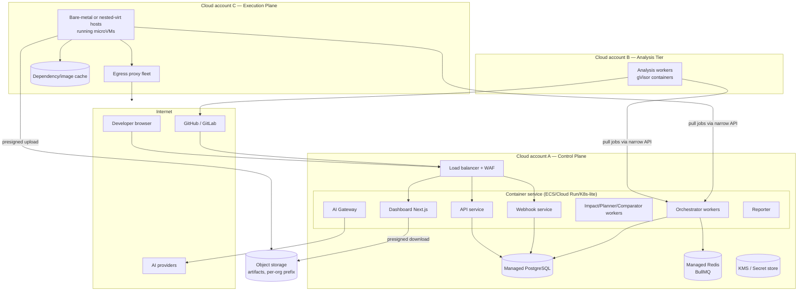

# 06 — Deployment Architecture

**Purpose:** Describe how the platform is deployed for MVP and how it scales later.
**Related:** [05-system-architecture](./05-system-architecture.md), [17-cloud-execution](./17-cloud-execution.md), [19-security-and-safety](./19-security-and-safety.md)

## 1. Principles

- **Operational simplicity first.** MVP runs on one cloud provider, one region, managed services wherever possible.
- **Physically separate accounts/projects** for Control Plane and Execution Plane so a sandbox escape does not land inside the control-plane network.
- **Everything as code** (Terraform or equivalent), including worker host images.

## 2. MVP deployment (single region)

Notes:
- Workers in accounts B and C **pull** work through a narrow, authenticated job API (mTLS + per-worker identity) rather than connecting to Redis/Postgres directly. This keeps control-plane datastores unreachable from sandboxes.
- Artifacts upload with presigned, single-object, short-TTL URLs scoped to `org/project/run/`.
- The Execution Plane is the only component that needs bare-metal or nested-virtualization-capable instances (for Firecracker). ⚑ If this is too heavy for MVP, fall back to **one small cloud VM per run** from a warm pool (slower startup, simpler ops). See [17-cloud-execution](./17-cloud-execution.md) §3.

## 3. Environments

| Environment | Purpose | Notes |
|---|---|---|
| `dev` | Engineers | Local docker-compose for control plane; execution via local Docker (trusted code only) |
| `staging` | Integration, dogfooding | Full three-account topology; tests the platform against sample apps |
| `prod` | Customers | Same topology; separate keys, separate AI provider accounts |

The platform will dogfood itself: a staging project that tests a set of reference apps (Next.js + NestJS + Postgres; React SPA + Express + MongoDB; a monorepo with admin app) on every platform release.

## 4. Scaling path

| Pressure | Response |
|---|---|
| More concurrent runs | Horizontal microVM host pool with autoscaling on queue depth; per-tenant concurrency caps |
| Slow sandbox startup | Warm pools; snapshot-restore of pre-booted VMs; dependency cache keyed by lockfile hash; image layer cache |
| Browser-heavy workloads | Split browser workers from app stack (browser in separate microVM on same private network) — P4 |
| Graph size / traversal | Per-project in-memory graph cache; later dedicated graph store |
| Multi-region / data residency | Per-region cells (control plane + execution) with org pinned to a region — P5 |
| Enterprise isolation | Dedicated execution pools per org; self-hosted runner option (customer VPC) — P5 |

## 5. Release & operations

- Blue/green for stateless services; forward-only DB migrations.
- Analyzer and execution-engine versions are recorded per Run; rolling out a new analyzer version triggers background re-snapshot of active projects' default branches (rate-limited).
- Runbooks required before GA: stuck runs, sandbox host exhaustion, AI provider outage, Git provider outage/rate-limit, webhook backlog.
