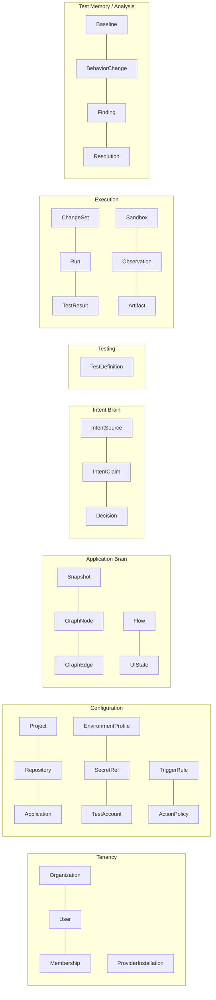
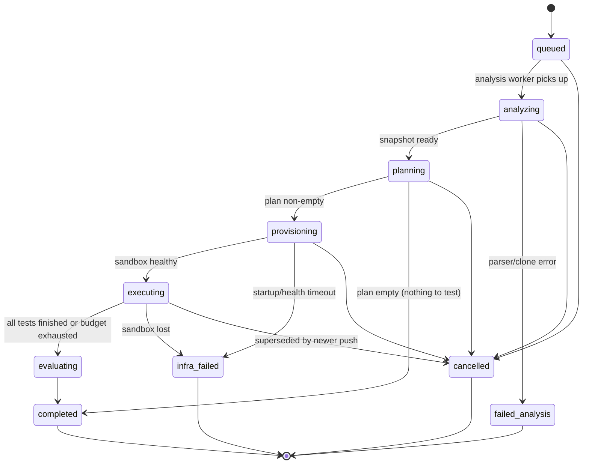
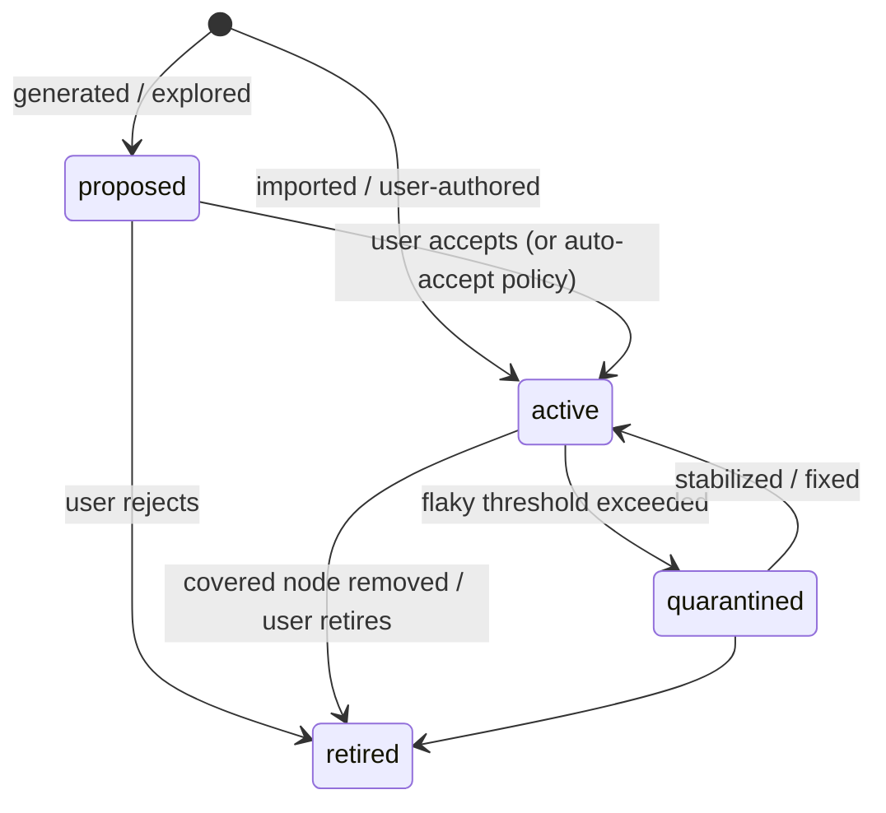
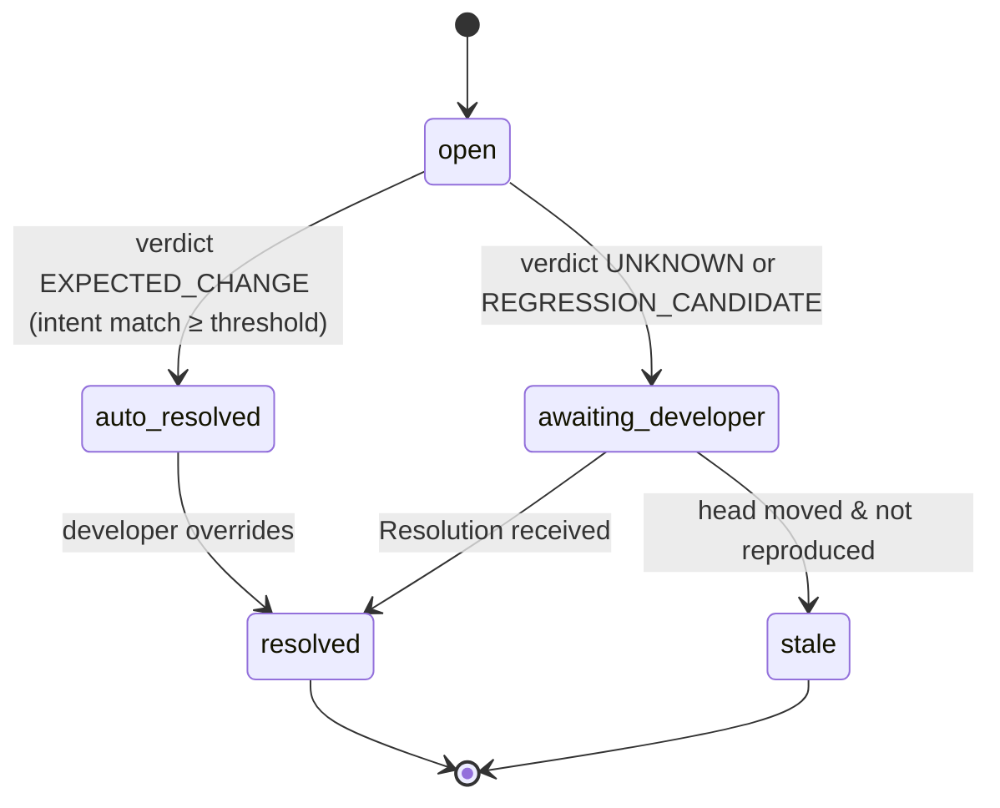
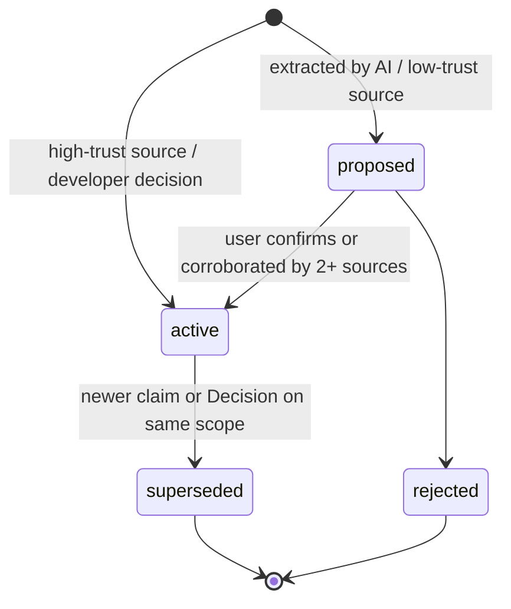
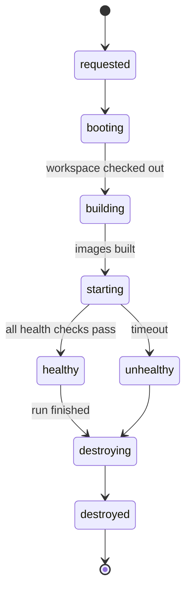
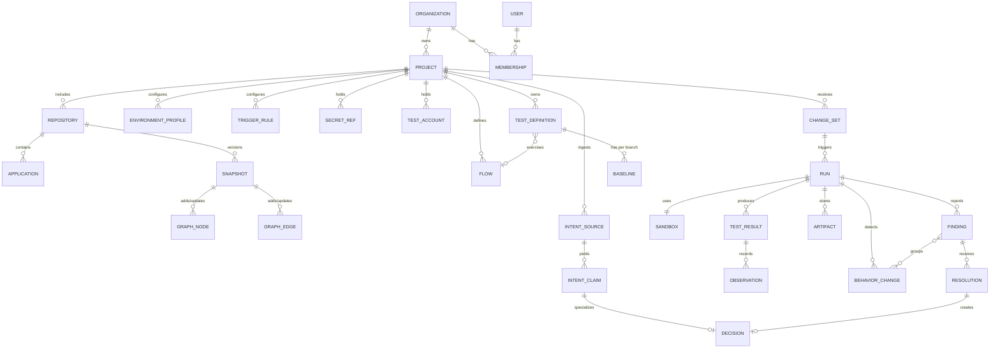

# 07 — Domain Model

**Purpose:** Define the normalized conceptual domain: entities, ownership, lifecycles, relationships, and state transitions. Physical storage is in [22-data-model](./22-data-model.md).
**Related:** [08-project-brain](./08-project-brain.md), [09-intent-brain](./09-intent-brain.md), [10-application-graph](./10-application-graph.md), [20-test-memory](./20-test-memory.md)

## 1. Normalization of the brief's candidate list

The brief proposed 33 candidate entities. Many are either *types of the same thing* or *processing concepts* rather than persisted entities. Normalization:

| Brief candidate(s) | Disposition | Rationale |
|---|---|---|
| Module, Component, Route, API, Service, DatabaseModel, Dependency | → **GraphNode** (typed) and **GraphEdge** (typed) | These are all elements/relations of the Application Graph. Separate tables per type would explode schema churn every time a framework adds a concept. Type-specific attributes go in a typed `attrs` payload. |
| GraphNode, GraphEdge | **Kept** | Core of Application Brain. |
| Application | **Kept** as **Application** | A deployable unit within a project (frontend, backend, admin). Needed for env config and ownership of graph nodes. |
| Requirement, AcceptanceCriteria, ExpectedBehavior, API contract, security rule | → **IntentClaim** (typed by `kind`) | All are statements of intended behavior with source + confidence. One entity with `kind` = `requirement` \| `acceptance_criterion` \| `business_rule` \| `contract` \| `security_rule` \| `flow_expectation` \| `constraint`. |
| Decision | **Kept** as a specialization: an IntentClaim with `source.type = developer_decision`, plus a link to the BehaviorChange that produced it | Decisions have extra provenance (who, why, when, which change). |
| ObservedBehavior | → **Observation** | Clearer name; atomic recorded facts. |
| BehaviorChange | **Kept** | Central to the comparator. |
| Failure, Regression | → **Finding** with a `verdict` | "Regression" is a verdict, not a thing. A Finding is the reportable unit of analysis (one per failed test or behavior change cluster). |
| TestScenario, TestCase | → **TestDefinition** (versioned) + optional `flowId` link | Scenario ≈ a Flow; case ≈ a TestDefinition. Two levels were redundant. |
| TestStep | Embedded in **TestDefinition** (definition) and **TestResult** (execution) | Never queried independently at scale; embedding keeps versions atomic. |
| TestRun | → **Run** (one per trigger execution) + **TestResult** (one per test in the run) | Brief conflated the run and per-test results. |
| Evidence, Artifact | → **Artifact** (object-storage blob + metadata) | Evidence is the role; Artifact is the thing. Findings reference Artifacts. |
| Environment, ExecutionEnvironment | → **EnvironmentProfile** (config) and **Sandbox** (runtime instance) | Brief used both names ambiguously. |
| Credential | → **SecretRef** (and **TestAccount**, a structured secret bundle with role) | Secret values are never in the domain store — only references into the secret vault. |
| Trigger, Pipeline | → **TriggerRule** (config) and **ChangeSet** (the event instance: base/head/PR) | "Pipeline" is a CI concept outside our domain. |
| ExecutionJob | Removed from domain | A queue implementation detail of Run stages. |
| — (missing) | **Added: Baseline** | Needed to define "behavior changed". |
| — (missing) | **Added: Snapshot** | Versioning of the graph per commit. |
| — (missing) | **Added: Flow, UIState** | First-class user journeys and runtime states. |
| — (missing) | **Added: Resolution** | Developer answer to a Finding/BehaviorChange. |
| — (missing) | **Added: ActionPolicy** | Safety rules for dangerous actions. |
| — (missing) | **Added: Organization, User, Membership, ProviderInstallation** | Tenancy and auth. |

## 2. Bounded contexts

Ownership rule: **every entity except Organization/User belongs to exactly one Project** (directly or transitively) and carries `projectId` + `orgId` for tenant scoping.

## 3. Entity catalogue

For each entity: purpose · owner · lifecycle · key fields · relationships · persistence.

### 3.1 Tenancy

**Organization** — billing and isolation boundary.
Fields: `id, name, plan, dataRegion, createdAt, settings{aiDataPolicy, retentionDays}`. Persistence: relational, permanent until deletion request.

**User** — a human identity (via OAuth to GitHub/GitLab or SSO). Fields: `id, email, displayName, providerIdentities[]`.

**Membership** — `(orgId, userId, role ∈ {owner, admin, member, viewer})`. Project-level role overrides optional (P2).

**ProviderInstallation** — a GitHub App installation or GitLab integration token for an org. Fields: `id, orgId, provider ∈ {github, gitlab}, externalInstallationId, scopes[], status`. Credential material stored in vault, referenced by `secretRef`.

### 3.2 Configuration

**Project** — the testable product. Fields: `id, orgId, name, defaultBranch, primaryRepositoryId, settings{runModeDefaults, budgets, aiEnabled}`.
Lifecycle: `onboarding → active → paused → archived`.

**Repository** — a connected repo. Fields: `id, projectId, installationId, provider, externalId, fullName, defaultBranch, monorepoLayout?`. A project may have several repositories (frontend and backend repos) — MVP supports **one**, schema supports many.

**Application** — a deployable unit inside a repo (e.g. `apps/web`, `apps/api`, `apps/admin`). Fields: `id, projectId, repositoryId, name, kind ∈ {frontend, backend, admin, worker, other}, rootPath, framework, detectedBy ∈ {auto, user}`. Owns graph nodes via `applicationId`.

**EnvironmentProfile** — how to build and run the project in a sandbox. Versioned (config changes create a new version; runs record the version used).
Fields: `id, projectId, version, services[{name, applicationId?, image?, build?, start, port, healthCheck{path|cmd, timeout}, dependsOn[]}], datastores[{kind: mongodb|postgres|mysql|redis, version, seed?}], hooks{setup[], reset[], teardown[]}, envVars[{name, value | secretRef}], externalServices[{host, mode: sandbox|mock|block|allow}], baseUrls{frontend, admin}, resourceClass, source ∈ {autodetected, user_confirmed, user_edited}`.

**SecretRef** — pointer to an encrypted secret. Fields: `id, projectId, name, vaultPath, scope ∈ {build, runtime, test_account}, exposeToAI=false, createdBy, rotatedAt`. Values never leave the vault except into the sandbox at runtime.

**TestAccount** — named role-bearing login for the app under test. Fields: `id, projectId, role (e.g. 'admin','customer'), loginStrategy ∈ {form, storage_state, api_token, cookie}, secretRefs{username,password,token}, loginFlowId?`.

**TriggerRule** — when to run and how. Fields: `id, projectId, event ∈ {pull_request, merge_request, push, schedule, manual}, branchPattern?, cron?, mode ∈ {quick, smart, full, custom}, blocking(bool, sets required status), enabled`.

**ActionPolicy** — safety rules applied by the Execution Engine. Fields: `id, projectId, environmentClass ∈ {ephemeral, staging}, rules[{match: {role?, name~?, urlPattern?, httpMethod?, selector?}, effect: allow|deny|require_approval|mock}], version`. A platform-default policy is always applied first and cannot be weakened for `production`-class targets (which are forbidden in MVP anyway).

### 3.3 Application Brain

**Snapshot** — immutable version of the Application Graph for one commit. Fields: `id, projectId, repositoryId, commitSha, parentSnapshotId?, analyzerVersion, status ∈ {building, ready, failed}, stats, createdAt`. Incremental: a snapshot stores only nodes/edges that changed relative to its parent plus tombstones (see [10-application-graph](./10-application-graph.md)).

**GraphNode** — a typed element. Fields: `id (stable key), projectId, applicationId?, type, key (stable identity, e.g. 'route:GET /api/booking' or 'symbol:apps/api/src/booking/booking.service.ts#BookingService.create'), name, location{file, startLine, endLine}?, attrs{…type-specific}, layer ∈ {static, runtime, both}, firstSeenSnapshotId, lastSeenSnapshotId, riskTags[]`.
Types: `file, module, symbol (function/class/method), ui_route, ui_component, api_endpoint, controller, service, repository, db_model, db_collection, external_service, test_file, config, ui_state, feature (logical module grouping)`.

**GraphEdge** — typed relation. Fields: `id, projectId, from, to, type, layer ∈ {static, runtime}, confidence (0–1), evidence{source: 'import'|'call'|'route_decl'|'network_obs'|'ai_inferred'…, refs[]}, firstSeenSnapshotId, lastSeenSnapshotId`.
Types: `imports, calls, renders, routes_to, handles (endpoint→controller), invokes (ui→endpoint), reads, writes, depends_on_external, tests (test→node), belongs_to (node→feature), transitions_to (ui_state→ui_state)`.

**Flow** — a named user journey. Fields: `id, projectId, name, description, origin ∈ {discovered, imported_test, user_defined, ai_proposed}, status ∈ {proposed, active, retired}, steps[{uiStateKey, action, expectedTransitionTo}], criticality ∈ {low, medium, high, critical}, featureNodeIds[]`.

**UIState** — a fingerprinted runtime UI state (also a GraphNode of type `ui_state`; stored with richer attrs). Fields: `fingerprint, urlPattern, title, landmarks[], interactiveElements[{role, name}], lastSeenRunId`.

### 3.4 Intent Brain

**IntentSource** — a document or event that yields intent. Fields: `id, projectId, type ∈ {pr_description, commit_message, ticket, requirements_doc, api_spec, existing_test, db_constraint, design, developer_decision, manual_entry}, externalRef, contentHash, ingestedAt, trust ∈ {low, medium, high}`.

**IntentClaim** — one atomic statement of intended behavior.
Fields: `id, projectId, kind (see §1), statement (normalized text), structured? (machine-checkable form, e.g. {endpoint:'POST /booking', expectStatus:201} or {flowId, stepOrder:[...]}), scope{nodeIds[], flowIds[]}, sourceId, confidence (0–1), status ∈ {proposed, active, superseded, rejected}, supersedesId?, validFrom (commit/time), createdBy ∈ {system, ai, user}`.

**Decision** — IntentClaim subtype produced from a Resolution. Extra fields: `behaviorChangeId, decidedBy (userId), reason, oldBehaviorSummary, newBehaviorSummary`.

### 3.5 Testing

**TestDefinition** — a platform-managed test. Versioned (immutable versions; `currentVersion` pointer).
Fields: `id, projectId, name, category ∈ {functional, negative, boundary, security, regression, integration, ui, visual, api}, origin ∈ {imported, generated, user_authored, exploration}, format ∈ {dsl, playwright_spec}, flowId?, coversNodeIds[], intentClaimIds[], requiresAccountRole?, tags[], status ∈ {proposed, active, quarantined, retired}, versions[{version, body (DSL JSON or spec file ref), createdBy, createdAt, reason}]`.
Imported Playwright specs (`format=playwright_spec`) reference the file path in the repo at the run's commit; the platform does not copy user test code.

### 3.6 Execution

**ChangeSet** — the triggering event, normalized across providers.
Fields: `id, projectId, repositoryId, trigger ∈ {pull_request, merge_request, push, schedule, manual}, provider, baseSha?, headSha, mergeBaseSha?, branch, baseBranch?, prNumber?, prTitle?, prBody?, author, commitMessages[], changedFiles[{path, status, additions, deletions}], changedSymbols[] (filled by analysis), receivedAt, deliveryId (idempotency)`.

**Run** — one execution of a plan against one commit.
Fields: `id, projectId, changeSetId, triggerRuleId?, mode, envProfileVersion, snapshotId, plan{items[{testDefinitionId, version, reason, priority}], explorationTasks[], impactSummary}, budget{maxMinutes, maxAiTokens, maxActions}, status (see §4.1), stageTimings{}, sandboxId, summary{counts by verdict}, requestedBy`.

**Sandbox** — one ephemeral environment instance. Fields: `id, runId, projectId, workerHost, image digests[], startedAt, healthyAt?, destroyedAt?, status, egressPolicyId, logsArtifactId`.

**TestResult** — outcome of one TestDefinition version in one Run.
Fields: `id, runId, testDefinitionId, version, attempt, rawOutcome ∈ {passed, failed, error, skipped, timed_out}, verdict, confidence, durationMs, steps[{index, action, target, expected, actual, outcome, startedAt, durationMs, artifactIds[]}], failureSignature?, observationsRef`.

**Observation** — atomic recorded fact. High volume; stored in bulk (see 22).
Fields: `runId, testResultId?, seq, type ∈ {network, console, page_error, navigation, ui_state, assertion, dom_snapshot_ref, timing}, data{…}, ts`.

**Artifact** — blob in object storage. Fields: `id, projectId, runId, kind ∈ {screenshot, video, trace, har, dom_snapshot, console_log, service_log, diff, report}, storageKey, sizeBytes, sha256, redacted(bool), retentionClass, createdAt`.

### 3.7 Test Memory & Analysis

**Baseline** — accepted reference behavior for a test or flow on a reference branch.
Fields: `id, projectId, subject{testDefinitionId | flowId}, branch, commitSha, runId, observationDigest{flowSequence[], endpointsCalled[{method, pathPattern, status}], assertions[], uiFingerprints[], visualRefs[]}, acceptedBy ∈ {auto_green_on_branch, user}, createdAt, supersededBy?`.

**BehaviorChange** — a detected difference vs. Baseline.
Fields: `id, runId, projectId, subject{testDefinitionId|flowId}, dimension ∈ {flow_sequence, http_status, api_shape, ui_structure, visual, console_errors, timing, auth_behavior}, before, after, relatedChangedNodeIds[], intentEvaluation{supportingClaimIds[], contradictingClaimIds[], score}, verdict, confidence, status (see §4.3)`.

**Finding** — the reportable unit shown to developers; groups one or more failed TestResults and/or BehaviorChanges with a shared probable cause.
Fields: `id, runId, projectId, title, verdict, severity ∈ {low, medium, high, critical}, confidence ∈ {low, medium, high}, affectedNodeIds[], affectedFlowIds[], expected, actual, analysis{summary, reasoning, suspectedChangedFiles[], evidenceArtifactIds[]}, aiGenerated(bool), status, fingerprint (for dedupe across runs)`.

**Resolution** — developer answer. Fields: `id, targetType ∈ {finding, behavior_change, heal_proposal}, targetId, resolution ∈ {INTENTIONAL, REQUIREMENT_CHANGED, CONFIRMED_REGRESSION, FALSE_POSITIVE, IGNORE, ACCEPT_HEAL, REJECT_HEAL}, reason?, resolvedBy, resolvedAt, channel ∈ {dashboard, pr_comment, api}`.

(P3) **HealProposal** — self-healing candidate: `testDefinitionId, fromVersion, proposedBody, diff, confidence, evidenceArtifactIds[], status`.

## 4. State machines

### 4.1 Run

Supersession: a new push to the same PR cancels in-flight runs for that PR (configurable).

### 4.2 TestDefinition

Quarantined tests still run (to gather data) but cannot produce `REGRESSION_CANDIDATE` or block a PR.

### 4.3 BehaviorChange / Finding

On `resolved`:
- `INTENTIONAL` / `REQUIREMENT_CHANGED` → create **Decision**; mark Baseline for update when the change merges to the reference branch.
- `CONFIRMED_REGRESSION` → store regression evidence; raise risk score of affected nodes.
- `FALSE_POSITIVE` → store classification + reason; feed classifier calibration; possibly adjust test (proposal).
- `IGNORE` → suppress this Finding fingerprint for N days.

### 4.4 IntentClaim

### 4.5 Sandbox

Hard TTL enforced by the worker host independent of control-plane messages.

## 5. Key relationships (ER)

## 6. Invariants

1. A Run always references exactly one `headSha`, one `envProfileVersion`, one `snapshotId`, and one Sandbox — for reproducibility.
2. A verdict of `REGRESSION_CANDIDATE` requires ≥1 evidence Artifact and either a failed assertion or a BehaviorChange contradicted by an `active` IntentClaim or Baseline with confidence above threshold.
3. `EXPECTED_CHANGE` requires ≥1 supporting `active` IntentClaim (or Decision) whose scope intersects the BehaviorChange subject.
4. Baselines update only from runs on the reference branch (default branch) or by explicit user acceptance — never from PR branches automatically.
5. Secret values never appear in any domain entity, Observation, or Artifact (Artifacts are redacted before upload; see 19).
6. Runtime-layer edges never delete static-layer edges (they coexist with separate `layer`).
7. Every Decision links to the Resolution and the BehaviorChange that produced it.
