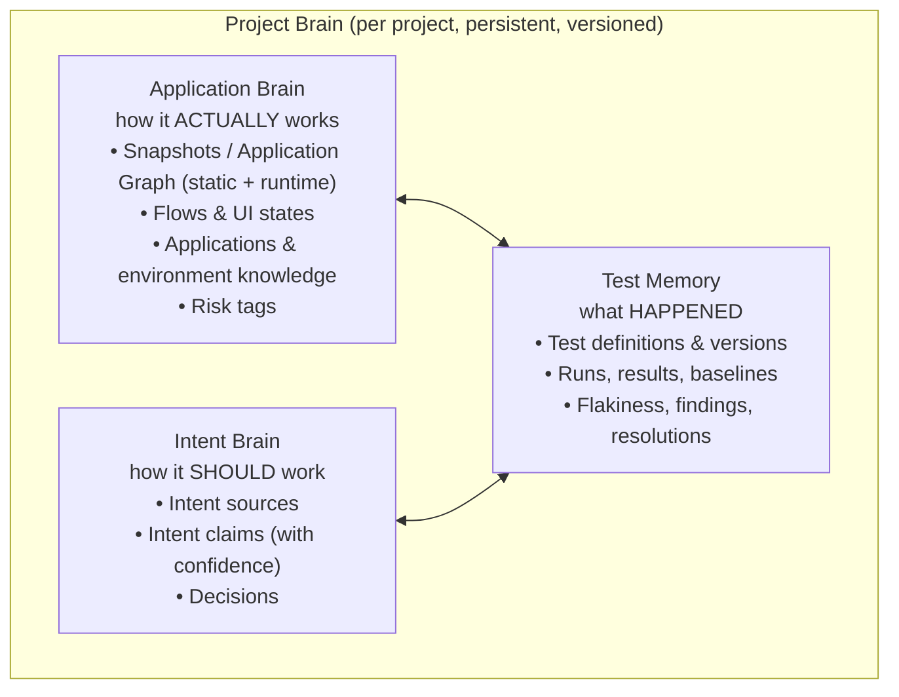
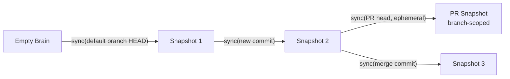

# 08 — Project Brain

**Purpose:** Define the persistent per-project knowledge store, its parts, and how it stays synchronized with the code.
**Related:** [07-domain-model](./07-domain-model.md), [09-intent-brain](./09-intent-brain.md), [10-application-graph](./10-application-graph.md), [20-test-memory](./20-test-memory.md)

## 1. Definition

The brief uses "Project Brain" and "Application Brain" interchangeably. This spec fixes the terms:

The three parts are separately owned modules with separate write paths. Only the **Comparator** reads all three to produce verdicts, and only **Resolutions** (developer feedback) write across them (Decision → Intent Brain; baseline acceptance → Test Memory).

## 2. What each part persists

| Brief requirement (§26) | Stored in |
|---|---|
| application structure, modules, dependencies | Application Brain — Graph |
| flows | Application Brain — Flows |
| environment configuration | Configuration (EnvironmentProfile), referenced by Application Brain |
| requirements, decisions, approved behavior changes | Intent Brain |
| tests, test results, failures | Test Memory |
| accepted / rejected changes | Test Memory (Resolutions) + Intent Brain (Decisions) |
| known flaky tests | Test Memory (flakiness stats) |
| known third-party failures | Test Memory (external-service health history) |
| historical behavior | Test Memory (Baselines + Observation digests) |

## 3. New vs existing project: one path

There is no separate "new project" architecture. Initial onboarding is an incremental sync from an **empty parent snapshot**.

- **Default-branch snapshots** are the canonical lineage.
- **PR snapshots** are branch-scoped overlays on the merge-base snapshot; they're used for impact analysis and are discarded (or retained for history only) after merge/close. They never mutate the canonical lineage.
- **Runtime knowledge** (runtime graph edges, UI states, flows) gathered on PR runs is stored as *branch-scoped observations*; it is promoted to the canonical Brain only when observed again on the default branch.

## 4. Synchronization

### 4.1 Triggers for sync

| Event | Sync action |
|---|---|
| Onboarding | Full static analysis of default branch HEAD; env auto-detect; import existing tests; optional initial exploration |
| Push to default branch | Incremental static analysis (changed files + dependents); promote runtime knowledge seen on this branch |
| PR/MR opened/updated | PR snapshot overlay (changed files only + reverse deps for impact) |
| Analyzer version upgrade | Background full re-analysis of default branch (rate-limited) |
| Scheduled | Nightly full re-analysis to correct drift from incremental errors |
| Resolution | Intent Brain / Baseline updates (see §5) |

### 4.2 Incremental algorithm (static)

1. Compute changed files between parent snapshot SHA and target SHA.
2. Re-run analyzers on changed files; for TS/JS, also re-resolve modules whose import resolution may change (tsconfig/package.json changes ⇒ full re-analysis of that Application).
3. Diff produced nodes/edges vs. parent for the affected file set: add, update, tombstone.
4. Validate referential integrity (edges to tombstoned nodes are tombstoned).
5. Mark snapshot `ready` (or `partial` if any plugin failed, with the failing scope recorded).

**Drift control:** the nightly full re-analysis is compared with the incremental result; divergence >0 nodes is logged as an analyzer bug metric.

### 4.3 Runtime knowledge merge

- Runtime edges (`invokes`, `transitions_to`) carry `lastSeenRunId` and a `seenCount`. They are never deleted by static sync; they **decay**: an edge not observed in the last N default-branch runs that exercised its source is marked `stale` (not deleted).
- Static vs runtime disagreement is recorded as a **GraphDiscrepancy** (static edge never observed; runtime edge with no static counterpart). Discrepancies are inputs to impact analysis and exploration prioritization, not errors. See [10-application-graph](./10-application-graph.md) §6.

## 5. Learning from feedback

| Resolution | Brain update |
|---|---|
| `INTENTIONAL` / `REQUIREMENT_CHANGED` | Decision created (Intent Brain, confidence 1.0, scoped to the changed flow/nodes). Old contradicting claims → `superseded`. Baseline replacement is scheduled for when the change reaches the default branch. |
| `CONFIRMED_REGRESSION` | Finding fingerprint stored as known-regression; affected nodes' risk score increased; test covering it is marked `regression`-critical. |
| `FALSE_POSITIVE` | Stored with reason; per-project classifier calibration updated (thresholds for that dimension/test); test may get a proposed tweak (e.g. wider timing tolerance). |
| `IGNORE` | Finding fingerprint suppressed for a TTL; recorded for audit. |

## 6. Consistency & concurrency

- Snapshots are immutable once `ready`. Concurrent syncs for different SHAs are independent.
- Intent Brain and Test Memory writes are transactional per Resolution.
- Baseline updates are serialized per `(subject, branch)` to avoid races between concurrent default-branch runs; the newest commit (by topological order on the branch) wins.

## 7. Size and retention

- Graph: store incremental diffs per snapshot; compact lineage (materialize full snapshot every K snapshots, delete intermediate diffs older than retention except those referenced by retained Runs).
- Observations: raw observations retained per retention policy; digests (for baselines) retained indefinitely while the baseline is live.
- See [22-data-model](./22-data-model.md) §5 for retention classes.

## 8. Open items
- How long to keep PR snapshots after close → [29-open-questions](./29-open-questions.md) Q-DATA-3.
- Multi-repo projects: cross-repo edges (frontend repo → backend repo) are via API endpoint matching; exact linkage strategy P3.
