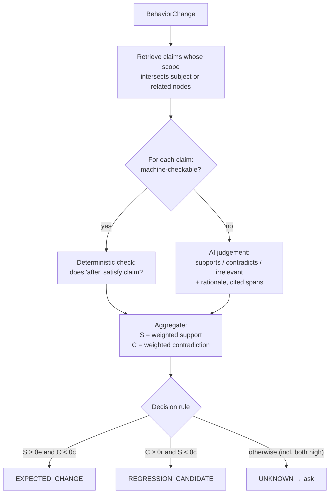
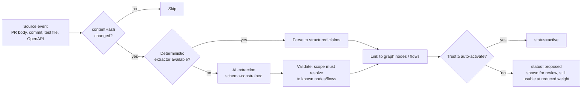

# 09 — Intent Brain

**Purpose:** Specify how intended behavior is captured, represented with confidence, evaluated against behavior changes, and refined by developer confirmation.
**Related:** [07-domain-model](./07-domain-model.md) §3.4, [08-project-brain](./08-project-brain.md), [20-test-memory](./20-test-memory.md), [15-ai-agent-architecture](./15-ai-agent-architecture.md)

## 1. Role

The Intent Brain answers: *"Is this observed behavior (or behavior change) what the team intended?"* It must be honest about not knowing. It is the input that separates `EXPECTED_CHANGE` from `REGRESSION_CANDIDATE` from `UNKNOWN`.

**Key revision vs brief:** the brief places the Intent Brain in Phase 6. But verdict classification is needed from the first run that detects a behavior change. The MVP therefore ships a **minimal Intent Brain** (PR/commit intent, existing tests, developer decisions); rich sources (tickets, requirement docs, design) come later.

## 2. Sources, trust, and phase

| Source | Default trust | Extraction | Phase |
|---|---|---|---|
| Developer decision (Resolution) | **High (1.0)** | Direct | MVP |
| Manual intent entry in dashboard | High (0.9) | Direct, structured form | MVP |
| Existing test assertions | Medium-low (0.5) — tests can be outdated | Deterministic: assertion → claim | MVP |
| PR/MR title + description | Medium (0.6) for statements of change; scoped to the PR | AI extraction (small model) → structured claims | MVP |
| Commit messages | Low-medium (0.4) | AI extraction | MVP |
| OpenAPI / GraphQL schema | High (0.85) for shape/status contracts | Deterministic parse | MVP (if present) |
| DB constraints (unique, required, enum) | High (0.8) | Deterministic from ORM/schema | P2 |
| Security rules config (route guards, RBAC maps) | Medium (0.7) | Static analysis + AI summary | P2 |
| Tickets (Jira/Linear/GitHub Issues linked in PR) | Medium (0.6) | AI extraction of acceptance criteria | P3 |
| Requirements docs (Markdown in repo, Confluence/Notion) | Medium (0.6) | AI extraction, user review | P3 |
| Design (Figma) | Low-medium (0.4) for layout; not for logic | P5 (future) |

Trust values are defaults; per-project calibration adjusts them from resolution history (e.g. if a project's PR descriptions consistently predict intentional changes, raise their weight).

## 3. Representation

An **IntentClaim** is atomic, scoped, and — where possible — machine-checkable.

```json
{
  "id": "ic_8f2",
  "kind": "flow_expectation",
  "statement": "Booking flow collects participants before date selection.",
  "structured": {
    "type": "flow_order",
    "flowId": "flow_booking",
    "order": ["activity", "participants", "date", "checkout"]
  },
  "scope": { "flowIds": ["flow_booking"], "nodeIds": ["ui_route:/book/[id]"] },
  "sourceId": "src_pr_412_body",
  "confidence": 0.6,
  "status": "active",
  "validFrom": { "branch": "feature/participants-first", "sha": "a1b2c3" },
  "createdBy": "ai"
}
```

Structured claim types (machine-checkable):

| `structured.type` | Checks |
|---|---|
| `http_contract` | method, path pattern, expected status set, response schema ref, auth requirement |
| `flow_order` | ordered list of flow step keys |
| `ui_presence` | element {role, name} present/absent/enabled on a UI state |
| `access_rule` | role R can / cannot access route or endpoint |
| `field_rule` | field required/optional, min/max, pattern |
| `business_rule` | free-text only (not machine-checkable) → requires AI judgement, lower evidential weight |

**Scoping of PR-sourced claims:** claims extracted from a PR are `validFrom` the PR branch and only become canonical if the PR merges. Closing a PR without merge moves them to `rejected`.

## 4. Evaluating a Behavior Change against intent

Input: a BehaviorChange `bc` (dimension, before, after, subject, related changed nodes).



- Weight per claim = `claim.confidence × sourceTrust × scopeMatch` (scopeMatch 1.0 exact subject, 0.6 related node, 0.3 same feature).
- AI judgements on free-text claims are capped at weight 0.5 of the claim's confidence, so free-text alone cannot produce `REGRESSION_CANDIDATE` above medium confidence.
- **Conflicting intent** (S and C both high) is always `UNKNOWN` with an explicit "conflicting sources" note — never resolved by the AI.
- Thresholds `θe, θr, θc` are per-project, start conservative (bias toward `UNKNOWN` over `REGRESSION_CANDIDATE`), and are calibrated from resolution history (see [20-test-memory](./20-test-memory.md) §6).
- Evaluation output stores the claim IDs used, their weights, and the AI rationale — so every verdict is explainable.

### Baseline-only case
If there is **no** relevant intent but the change contradicts a Baseline that passed repeatedly on the default branch, the verdict is `UNKNOWN` (not `REGRESSION_CANDIDATE`) — *unless* the change is in a "hard failure" dimension (5xx, uncaught page error, console error that was absent in baseline, element required by an existing test missing). Those have an implicit platform-level intent ("the app should not crash") with confidence 0.8.

Platform-default implicit claims (always present, lowest precedence vs explicit Decisions):
- No HTTP 5xx on first-party endpoints during a flow.
- No uncaught page errors.
- Protected routes are not accessible unauthenticated if they were protected in baseline.
- No new console errors vs. baseline.

## 5. Developer confirmation

When the verdict is `UNKNOWN` (or `REGRESSION_CANDIDATE`), the Reporter asks for a Resolution. Prompts must be **specific, few, and batched**:

```
Behavior change detected in flow "Booking" (PR #412)

  Before (main @ 9f1c2e):  Activity → Date → Participants → Checkout
  After  (PR   @ a1b2c3):  Activity → Participants → Date → Checkout

Related code changes: apps/web/src/booking/BookingWizard.tsx (+48 −31)
Intent found: PR description mentions "participant count first" (confidence: medium)
Evidence: [trace] [before/after screenshots]

[ Intentional ]  [ Requirement changed ]  [ Investigate as regression ]  [ Ignore ]
```

Rules:
- Max N (default 3) confirmation prompts per PR comment; the rest summarized with a dashboard link.
- Group BehaviorChanges sharing a root (same flow + same changed file) into one prompt.
- Resolution can be given in the dashboard, via PR comment command (`/qa intentional <id> reason…`), or via API.
- Resolving on a PR creates a **branch-scoped Decision**; it becomes canonical on merge.

### Decision record (stored)
```json
{
  "kind": "flow_expectation",
  "structured": { "type": "flow_order", "flowId": "flow_booking",
                  "order": ["activity","participants","date","checkout"] },
  "statement": "Booking flow intentionally changed: participants before date.",
  "reason": "Participant count affects availability.",
  "behaviorChangeId": "bc_91",
  "decidedBy": "user_17",
  "confidence": 1.0,
  "supersedes": ["ic_3a0"]
}
```

## 6. Intent ingestion pipeline



Claims whose scope cannot be resolved to any known node or flow are stored as `proposed` with `scope: unresolved` and not used in evaluation.

## 7. Guardrails
- The AI never creates `active` claims from its own inference about "what makes sense". Every claim cites a source.
- Secrets and PII in source documents are redacted before AI extraction.
- Decisions are auditable: who, when, why, which evidence.

## 8. Open items
- Which ticket systems first → Q-INT-2. Whether requirements docs live in-repo by convention (`/qa/intent/*.md`) → Q-INT-1.
