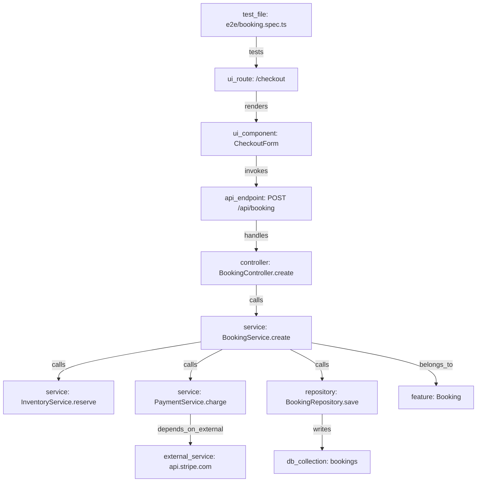

# 10 — Application Graph

**Purpose:** Specify the static and runtime graph: node/edge types, construction, versioning, and comparison.
**Related:** [07-domain-model](./07-domain-model.md) §3.3, [08-project-brain](./08-project-brain.md), [11-runtime-exploration](./11-runtime-exploration.md), [12-change-impact-analysis](./12-change-impact-analysis.md)

## 1. Purpose

The Application Graph connects UI → API → backend code → data, so a code change can be mapped to user-visible flows, and a user-visible failure can be mapped back to code.

## 2. Layers

| Layer | Source | Answers | Mutability |
|---|---|---|---|
| **Static** | Analyzers over source/config at a commit | "What does the code say is connected?" | Rebuilt per snapshot |
| **Runtime** | Observations from test runs and exploration | "What actually happened?" | Accumulates with decay |

Edges carry `layer`. The same logical relation seen by both has two edges (one per layer), making disagreement queryable. **Runtime never overwrites static.**

## 3. Node types and how they are discovered (MVP stack)

| Node type | Key format | MVP discovery |
|---|---|---|
| `file` | `file:<path>` | Repo tree |
| `symbol` | `symbol:<path>#<Class.method>` | TS compiler API / tree-sitter |
| `ui_route` | `ui_route:<pattern>` | Next.js `app/` & `pages/` conventions; React Router config objects/JSX `<Route path>` (static literal paths only; dynamic ones flagged) |
| `ui_component` | `ui_component:<path>#<Name>` | Exported React components (PascalCase function returning JSX) |
| `api_endpoint` | `api_endpoint:<METHOD> <pattern>` | Express `app/router.<method>()`, NestJS decorators (`@Controller`, `@Get`…), Next.js route handlers, OpenAPI paths |
| `controller`/`service`/`repository` | `symbol:` with role attr | NestJS DI metadata; naming/folder heuristics (`*.controller.ts`, `*.service.ts`); role is an attribute, not a separate node |
| `db_model`/`db_collection` | `db_model:<name>` | Prisma schema, Mongoose `model()`, TypeORM `@Entity` |
| `external_service` | `external_service:<host>` | SDK imports (`stripe`, `@googlemaps/*`), literal base URLs, env var names (`*_API_URL`) |
| `test_file` | `test_file:<path>` | Playwright/Cypress/Jest file conventions |
| `config` | `config:<path>` | package.json, tsconfig, docker-compose, .env.example, CI files |
| `feature` | `feature:<slug>` | Folder clustering (`src/booking/**`) + route prefix + AI naming (proposed; user can edit) |
| `ui_state` | `ui_state:<fingerprint>` | Runtime only |

## 4. Edge types and construction

| Edge | Static construction | Runtime construction |
|---|---|---|
| `imports` | Import/require resolution (tsconfig paths, workspaces) | — |
| `calls` | Call-site resolution via TS type checker (best effort; dynamic dispatch → lower confidence) | P4: OpenTelemetry spans |
| `renders` | JSX element references to known components | — |
| `routes_to` | Router config → component | Navigation observed |
| `invokes` (UI→API) | `fetch/axios` calls with literal/template URLs; generated API clients; **low confidence** | **Network observation** during a flow: request from a UI state to an endpoint pattern (high confidence) |
| `handles` (endpoint→handler) | Framework route declaration | P4: server spans |
| `reads`/`writes` | ORM calls in repositories | P4: DB spans |
| `depends_on_external` | SDK import / URL | Egress proxy logs |
| `tests` | Test file → routes visited (`page.goto` literals), imported modules, endpoints mocked | Test run: UI states & endpoints hit while test ran (**high value**: this is how imported tests get mapped to code) |
| `transitions_to` | — | UI state A → action → UI state B |
| `belongs_to` | Feature clustering | — |

**Linking UI to backend in MVP (no backend instrumentation):**
`ui_state --invokes(runtime)--> api_endpoint pattern` (from network log, with URL → route-pattern matching against static endpoints) `--handles(static)--> handler symbol --calls(static)--> …`. This gives an end-to-end chain with one runtime hop and the rest static. Backend tracing (OpenTelemetry auto-instrumentation injected in the sandbox) is P4 and upgrades `calls/handles/reads/writes` with runtime confirmation.

**URL → endpoint pattern matching:** normalize observed paths (numeric/UUID/ObjectId segments → `:param`), then match against static endpoint patterns; unmatched observed endpoints become runtime-only `api_endpoint` nodes flagged `unmapped`.

## 5. Versioning

- Each Snapshot stores nodes/edges added, updated, or tombstoned relative to its parent (see [08-project-brain](./08-project-brain.md) §4).
- Node identity is the `key` (stable across commits as long as path + symbol name are stable). Renames/moves: detected via git rename detection + symbol body similarity; recorded as `renamed_from` attribute so history (tests, baselines, risk) follows the node.
- Query "graph at commit X" = materialize nearest full snapshot + apply diffs. Cached per hot SHA.

## 6. Static vs runtime comparison

Computed after each run that produced runtime edges.

| Discrepancy | Meaning | Use |
|---|---|---|
| Static `invokes` edge, never observed at runtime across N flows | Dead code, feature flag, or unexplored path | Exploration target; lower weight in impact |
| Runtime `invokes` edge with no static counterpart | Dynamic URL construction, third-party SDK call, or analyzer gap | Trust runtime for impact; log analyzer-gap metric |
| Runtime transition not in any known Flow | New or undiscovered journey | Propose a Flow |
| Known Flow transition missing in this run | Possible behavior change | BehaviorChange candidate (dimension `flow_sequence`) |

Discrepancies are stored as records (`GraphDiscrepancy{type, staticEdgeId?, runtimeEdgeId?, firstSeen, count}`) and surfaced in the dashboard's graph view.

## 7. Flows

Flows are the bridge between graph and tests.

- **Discovery:** from imported tests (each test's sequence of UI states), from exploration (frequent transition paths ending in a "goal" state such as a form submission 2xx), and from user definition.
- **Naming:** AI proposes names/descriptions from state landmarks and route names (small model), user can edit.
- **Criticality:** user-set; default heuristic = involves payment/auth/checkout/write endpoints → `high`.
- A Flow's `featureNodeIds` and the union of nodes reachable from its UI states form its **footprint**, used by impact analysis.

## 8. Scale assumptions (to validate)

**Hypothesis:** a mid-size TS monorepo (≈2k source files) produces ~10⁴–10⁵ nodes and ~10⁵–10⁶ edges (symbol-level). The per-project graph fits in memory of an analysis/impact worker (hundreds of MB). If validation shows otherwise, fall back to file-level granularity for `calls` edges.

## 9. Open items
- Symbol-level vs file-level `calls` graph for MVP → Q-ANA-2.
- Non-TS backends (Python/Go/Java) analyzer order → Q-ANA-1.
