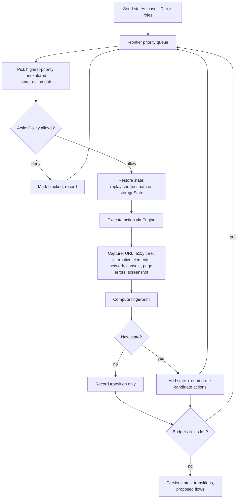

# 11 — Runtime Exploration

**Purpose:** Specify how the platform discovers runtime flows by exploring the running application safely and within budget.
**Related:** [10-application-graph](./10-application-graph.md), [14-playwright-engine](./14-playwright-engine.md), [15-ai-agent-architecture](./15-ai-agent-architecture.md), [19-security-and-safety](./19-security-and-safety.md)

## 1. Goals and non-goals

**Goals:** discover UI states and transitions; link UI states to API calls; propose Flows; refresh knowledge for impacted areas; find hard failures (5xx, page errors) along the way.

**Non-goals (MVP):** exhaustive crawling; exploring behind CAPTCHA/2FA; exploring external domains; performing irreversible actions.

## 2. Exploration modes

| Mode | When | Scope | Budget default (hypothesis) |
|---|---|---|---|
| **Onboarding exploration** | After first successful sandbox start | Breadth-first from base URLs, per test account role | 20 min, 300 actions |
| **Targeted exploration** | Smart run where impacted routes have no covering test/flow | Start at impacted `ui_route`s, depth ≤ 3 | 5 min, 60 actions |
| **Nightly deep exploration** | Schedule | Unvisited states, stale runtime edges, discrepancies | 45 min, 1000 actions |
| **Manual** | "Explore the admin area" | User-specified root/pattern | User-set |

## 3. State model

A **UI state** is identified by a **fingerprint** rather than by URL (SPAs change state without URL changes, and URLs carry IDs).

```
fingerprint = hash(
  urlPattern(url),                       // /booking/:id  (ID segments normalized)
  a11yStructureSignature,                // roles + depth of landmark/heading/form tree, text stripped
  interactiveSignature,                  // sorted set of (role, normalized accessible name) for visible actionable elements
  modalOpen?, activeTab?                 // key UI modes derived from a11y (dialog role, aria-selected)
)
```

Design choices:
- Visible **text content** is excluded (except accessible names of controls, normalized: numbers → `#`, dates → `<date>`) so lists with different data map to the same state.
- **Network activity** is not part of identity (too volatile) but is recorded as attributes of the transition.
- Near-duplicate detection: Jaccard similarity of `interactiveSignature` ≥ 0.9 and same `urlPattern` ⇒ same state (merge). Threshold is per-project tunable.
- Lists/grids: repeated sibling structures collapse to one representative item ("item template") to prevent state explosion across list entries.

## 4. Exploration loop



### Candidate actions per state (deterministic enumeration)
- Links and buttons (visible, enabled) by `{role, name}`.
- Forms: one "valid fill + submit" action (values from Test Data generator, see [21-test-data-management](./21-test-data-management.md)) and, in P2, targeted negative fills.
- Menus/tabs/dialogs: open/close.
- Excluded by default: `logout`, elements matching destructive patterns (`delete|remove|cancel subscription|pay|purchase|send`) unless policy allows in the sandbox with mocks.

### Prioritization (score, higher first)
`score = w1·isImpacted(route) + w2·unvisitedEdgeFromStatic + w3·formSubmit + w4·noveltyOfName − w5·depth − w6·timesSimilarTried`

AI involvement is **optional and bounded**: every K steps (or when the frontier is empty but budget remains) the Exploration Controller may ask a small model to rank candidate actions by semantic goal ("which actions progress a booking?") or to propose form values for unusual fields. The AI returns a ranked list of existing candidate IDs — it cannot invent actions.

## 5. Limits (state-explosion controls)

| Control | Default (hypothesis) | Notes |
|---|---|---|
| Max actions | per mode (§2) | Hard stop |
| Max wall-clock | per mode | Hard stop |
| Max depth from seed | 6 (onboarding), 3 (targeted) | |
| Max distinct states | 200 per role | |
| Max visits per urlPattern | 10 | Stops pagination/ID loops |
| Domain allow-list | App base URLs only | Off-domain navigations blocked and recorded |
| Route deny-list | User-configurable (`/admin/danger/**`) | |
| AI calls | ≤ 1 per 10 actions; token budget per run | |
| Duplicate detection | Fingerprint + near-duplicate merge | |

## 6. Restoring state

Returning to a frontier state is the main cost. Strategies, in order:
1. **Storage state** (cookies/localStorage) + direct URL, if the state is URL-addressable.
2. **Replay shortest known path** from a seed state.
3. **Data reset** between exploration branches that performed writes (reset hook, or DB snapshot restore — see 21).

## 7. Outputs

- New/updated `ui_state` nodes and `transitions_to`/`invokes` runtime edges.
- **Proposed Flows**: paths from a seed to a "goal state" (successful form submit 2xx, confirmation page, created resource). Status `proposed` until accepted or seen repeatedly.
- **Findings from exploration**: only hard failures (5xx, uncaught page errors, broken links 404 on first-party routes) with evidence; verdict via normal Comparator rules.
- Coverage metrics: states per route, unexplored static routes, blocked actions.

## 8. Authentication during exploration

Exploration runs once per configured TestAccount role (e.g. anonymous, customer, admin). Login uses the account's `loginStrategy` (see [21-test-data-management](./21-test-data-management.md) §2). Auth-boundary observations (state reachable by role A but not B) feed `access_rule` claims as **proposed** intent.

## 9. Open items
- Default budgets need calibration on reference apps → Q-EXE-4.
