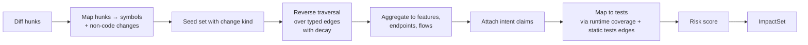

# 12 — Change Impact Analysis

**Purpose:** Specify how a code change is mapped to affected modules, APIs, flows, intent, and tests, with a risk score.
**Related:** [10-application-graph](./10-application-graph.md), [13-test-generation](./13-test-generation.md), [16-ci-cd-integration](./16-ci-cd-integration.md), [20-test-memory](./20-test-memory.md)

## 1. Inputs

- `ChangeSet` (base/head/merge-base SHAs, changed files, PR text).
- Canonical Snapshot at merge-base + PR overlay Snapshot at head.
- Runtime layer (invokes, tests edges) and Flows.
- Test Memory: coverage map (test → nodes touched at runtime), historical failures, flakiness.
- Intent Brain: claims scoped to nodes/flows.

**Diff semantics.** For PRs: `git diff <base>...<head>` (three-dot = changes on head since merge-base). Store `mergeBaseSha` explicitly. For pushes: `before..after`. Force-push: if `before` is not an ancestor of `after`, diff against the last analyzed ancestor on that branch, else merge-base with default branch.

## 2. Pipeline



### 2.1 Seeds: hunk → symbol
- Code files: enclosing symbol(s) of each changed hunk (function/method/class/component). Whole-file change or new file → all exported symbols.
- Change kind per seed: `signature_change` (exported types/params changed), `body_change`, `added`, `removed`, `renamed`.
- **Non-code changes** get special seeds:

| Change | Seed |
|---|---|
| `package.json` deps / lockfile | The Application node + packages' importers; risk +; if major version bump → broad |
| `tsconfig`, build config, env schema | Whole Application (broad impact) |
| DB schema / migration | `db_model` node → all readers/writers |
| OpenAPI spec | Endpoint nodes changed |
| CSS/global styles | All `ui_route`s of the Application, **visual** dimension only |
| i18n/locale files | Components that reference changed keys (static lookup), else UI routes |
| Test files only | The tests themselves (run them), no product impact |
| Docs only | None → plan may be empty (report "no testable change") |
| CI / Docker config | Environment profile validation run (startup smoke) |

### 2.2 Traversal
Reverse (callers-of / dependents-of) BFS from seeds over edges, with per-edge-type weights and decay per hop:

| Edge (reverse direction) | Weight |
|---|---|
| `calls` (static, resolved) | 0.9 |
| `calls` (static, dynamic dispatch, low conf) | 0.5 |
| `imports` (no call edge known) | 0.6 |
| `handles` (handler → endpoint) | 1.0 |
| `invokes` runtime (endpoint → ui_state) | 1.0 |
| `invokes` static-only | 0.6 |
| `renders` (component → parent / route) | 0.9 |
| `reads`/`writes` via same `db_model` (sibling writers → readers) | 0.5 |
| `tests` (node → test) | 1.0 (terminal) |

`impact(node) = max over paths (∏ edge weights × 0.85^hops)`; stop when impact < 0.15 or hops > H (default 8). `signature_change` seeds start at 1.0; `body_change` at 0.9. Shared utility fan-out guard: if a seed reaches > X% (default 30%) of an Application's nodes, mark `broad_impact` and stop expanding at feature level (plan escalates mode rather than enumerating).

### 2.3 Aggregation
- **Affected endpoints:** `api_endpoint` nodes reached.
- **Affected flows:** Flows whose footprint intersects reached nodes (by `ui_state`/`ui_route` or endpoints invoked in the flow). Flow impact = max node impact in footprint.
- **Affected features/modules:** `belongs_to` targets.
- **Affected intent:** claims scoped to reached nodes/flows (used later by Comparator and by generator).

### 2.4 Test mapping
Priority of evidence that a test covers a node:
1. **Runtime coverage** (test run observed hitting the UI state / endpoint) — strongest.
2. Static `tests` edges (goto literals, imports).
3. Flow link (test exercises flow X, flow footprint contains node).

Tests are candidates if they cover any reached node with impact ≥ τ (default 0.3).

### 2.5 Risk score (per impacted item and overall)

`risk = impact × max(criticality, securityRelevance) × (1 + historicalFailureRate) × externalFactor`

- `criticality`: flow criticality (critical 1.0, high 0.8, medium 0.5, low 0.3).
- `securityRelevance`: 1.0 if node is auth/session/permission/payment-related (tagged by analyzer heuristics: guard decorators, middleware names, `auth`, `role`, `permission`, payment SDK).
- `historicalFailureRate`: confirmed regressions on this node in the last 90 days (normalized).
- `externalFactor`: 1.2 if path includes `depends_on_external`.

Overall run risk = bucketed max → `Low | Medium | High | Critical`.

## 3. Output (ImpactSet)

```json
{
  "changeSetId": "cs_77",
  "seeds": [{"node":"symbol:apps/api/src/payment/payment.service.ts#PaymentService.charge","kind":"body_change"}],
  "affected": {
    "features": [{"key":"feature:booking","impact":0.81},{"key":"feature:checkout","impact":0.77},{"key":"feature:order","impact":0.52}],
    "endpoints": [{"key":"api_endpoint:POST /api/booking","impact":0.81},{"key":"api_endpoint:POST /api/payment","impact":0.9}],
    "flows": [{"id":"flow_booking","impact":0.81,"criticality":"critical"},{"id":"flow_checkout","impact":0.77,"criticality":"critical"}],
    "intentClaims": ["ic_12","ic_40"]
  },
  "candidateTests": [
    {"testDefinitionId":"td_booking_happy","reason":"runtime coverage of POST /api/booking","impact":0.81},
    {"testDefinitionId":"td_unauth_payment","reason":"security-relevant path","impact":0.9}
  ],
  "uncoveredImpacted": [{"flowId":"flow_refund","impact":0.44}],
  "broadImpact": false,
  "risk": "High",
  "graphCompleteness": "complete",
  "explanations": { "api_endpoint:POST /api/booking": ["PaymentService.charge ←calls BookingService.create ←calls BookingController.create ←handles POST /api/booking"] }
}
```

Every affected item carries a **path explanation** — this goes into the report so developers can see *why* a test was selected.

## 4. Mode selection interaction

| Mode | Uses ImpactSet how |
|---|---|
| Quick | Seeds + 1 hop; only tests with direct coverage |
| Smart | Full ImpactSet with τ; + critical regression tag set; + targeted exploration/generation for `uncoveredImpacted` if budget allows |
| Full | Ignores ImpactSet for selection (runs all active tests), still used for ordering and report |
| Manual | User scope (flow/feature/route) replaces seeds; traversal forward for dependencies |

## 5. Safety valves against under-selection
- If `graphCompleteness` is `partial` (an analyzer failed) → escalate to all tests of affected Applications.
- If `broadImpact` → escalate to Full (bounded by budget; critical first).
- **Shadow full runs** (scheduled, default weekly per project) measure *selection recall*: failures in tests Smart mode would have skipped. Recall below target (hypothesis 95%) lowers τ for the project automatically and alerts.
- Always include tests tagged `@critical` by the user regardless of impact.

## 6. Deterministic vs AI
Impact analysis is **deterministic**. AI may optionally (P3) be asked to review PR text + ImpactSet to suggest *additional* areas ("PR says 'also fixes refund rounding'") — suggestions add seeds with low starting impact and are labelled AI-suggested.

## 7. Open items
- Default τ, H, decay values need calibration against reference apps with injected faults → Q-ANA-3.
