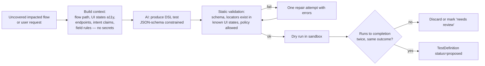

# 13 — Test Generation & Planning

**Purpose:** Specify how test plans are built (selection first, generation second), the test categories, and the platform-owned test format.
**Related:** [12-change-impact-analysis](./12-change-impact-analysis.md), [14-playwright-engine](./14-playwright-engine.md), [15-ai-agent-architecture](./15-ai-agent-architecture.md), [21-test-data-management](./21-test-data-management.md)

## 1. Principle: select before you generate

Generated tests are the most error-prone artifact in the system (wrong oracle, flaky locators). Order of preference:

1. **Existing user tests** (imported Playwright specs) that cover impacted nodes.
2. **Accepted platform tests** (`active` TestDefinitions) covering impacted nodes/flows.
3. **Derived checks** (deterministic, no AI): endpoint contract checks from OpenAPI, auth checks from access rules, smoke loads of impacted routes.
4. **Generated tests** (AI-assisted) for impacted flows with no coverage — produced as `proposed`, run in *advisory* mode.

Advisory tests' failures surface as `UNKNOWN` or "new test failed — review" and **never block** a PR until the test is accepted (auto-accept after K consecutive green default-branch runs is a per-project option).

## 2. Test Definition format (Action DSL)

Tests are stored as platform-owned JSON, not written into the user's repo (the MVP must not modify user code). Optional export to `.spec.ts` for teams that want to adopt them.

```json
{
  "name": "Booking — happy path (customer)",
  "category": "functional",
  "flowId": "flow_booking",
  "account": "customer",
  "data": { "participants": 2, "activity": { "$fixture": "activity.available" } },
  "steps": [
    { "action": "goto", "url": "/activities/{{data.activity.slug}}" },
    { "action": "click", "target": { "role": "button", "name": "Book now" } },
    { "action": "fill", "target": { "role": "spinbutton", "name": "Participants" }, "value": "{{data.participants}}" },
    { "action": "click", "target": { "role": "button", "name": "Continue" } },
    { "action": "click", "target": { "role": "gridcell", "name": { "$date": "next_available" } } },
    { "action": "click", "target": { "role": "button", "name": "Checkout" } },
    { "action": "assert", "assertion": { "type": "response", "method": "POST", "urlPattern": "/api/booking", "status": [200, 201] } },
    { "action": "assert", "assertion": { "type": "visible", "target": { "role": "heading", "name": { "$regex": "Booking confirmed" } } } }
  ],
  "intentClaimIds": ["ic_12"],
  "coversNodeIds": ["api_endpoint:POST /api/booking", "ui_route:/activities/[slug]"]
}
```

Benefits: validation against the ActionPolicy before execution; deterministic compilation; structured diffs for self-healing proposals; language-agnostic storage.

## 3. Categories and how each is produced

| Category | Deterministic derivation | AI-assisted generation | Phase |
|---|---|---|---|
| **Functional** (happy path, navigation, forms, search, CRUD, checkout) | From discovered Flows (replay path + assert end state + expected endpoints) | Naming, meaningful assertions, data choices | MVP (derivation), P3 (AI) |
| **Negative** (empty, invalid, malformed, missing required, invalid IDs) | From form field attributes (`required`, `type`, `min/max`, `pattern`) and schema field rules | Business-meaningful invalid values | P3 |
| **Boundary** (min, max, zero, empty, large) | From field rules / OpenAPI constraints | — | P3 |
| **Security / authz** (unauthenticated access, role restrictions, direct URL access, API authz) | Access matrix: for each protected route/endpoint in baseline × each role → expect deny/redirect/401/403 | Identify resource-ownership (IDOR) candidates | MVP (unauth + role matrix on discovered routes), P3 (IDOR) |
| **Regression** | Re-run of Baseline flows; tests linked to past `CONFIRMED_REGRESSION` findings | — | MVP |
| **Integration** (FE→BE, BE→DB, BE→external) | Flow tests with network assertions; P4 backend spans | — | MVP (FE→BE via network) |
| **API contract** | OpenAPI response-schema validation of observed responses | — | MVP (if spec present) |
| **UI** (visibility, disabled state, modals, responsive) | Presence/enabled assertions from baseline a11y; viewport matrix | — | P3 |
| **Visual** | Screenshot comparison vs baseline (see 18) | Explain diffs | P4 |

## 4. Generation pipeline (AI-assisted)



Constraints on generation:
- Assertions must reference either (a) an intent claim ID, or (b) observed baseline behavior. Assertions with neither are rejected — this prevents the AI from inventing an oracle.
- Locators must be `role+name`, `label`, `test-id`, or `text` — no CSS/XPath from the AI.
- Data uses fixtures/generators (see [21-test-data-management](./21-test-data-management.md)), never hard-coded secrets.

## 5. Planner

Inputs: ImpactSet, mode, TriggerRule, budget, Test Memory (durations, flakiness, failure history).

Algorithm (deterministic):
1. Candidate set = tests from ImpactSet (Smart) / all active (Full) / scope (Manual) + always-include `@critical`.
2. Remove `retired`; include `quarantined` as non-blocking.
3. Order by `risk × (1 + recentFailure) / expectedDuration` (fail-fast ordering).
4. Budget fit: include in order until estimated duration > budget; remaining are reported as `skipped (budget)` — never silently dropped.
5. Add derived checks (auth matrix for impacted protected routes, contract checks for impacted endpoints).
6. If budget remains and `uncoveredImpacted` non-empty: add targeted exploration and/or generation tasks (advisory).
7. Emit plan with a `reason` per item.

Optional AI assist (P3): re-rank within the same risk bucket using PR text semantics. The AI can reorder or suggest additions from the candidate pool; it cannot remove `@critical` tests.

## 6. Manual requests ("Test the booking flow")

1. Small model maps the request to known Flows/features (returns IDs from a provided list, with confidence).
2. If confidence low → ask the user to pick from top 3.
3. Planner builds a Manual-mode plan for that scope; missing coverage triggers targeted exploration.

## 7. Open items
- Auto-accept policy default for generated tests → Q-TST-1.
- Whether to support writing tests back to repo via PR (P4) → Q-TST-2.
