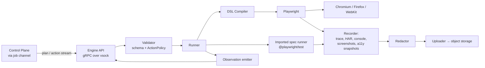

# 14 — Playwright Execution Engine

**Purpose:** Specify the deterministic execution layer inside the sandbox: action validation, locator resolution, waiting, assertions, evidence capture, and running imported tests.
**Related:** [13-test-generation](./13-test-generation.md), [11-runtime-exploration](./11-runtime-exploration.md), [18-evidence-and-reporting](./18-evidence-and-reporting.md), [19-security-and-safety](./19-security-and-safety.md)

## 1. Responsibility split

| AI (Zone 1, occasionally) | Execution Engine + Playwright (Zone 3, always) |
|---|---|
| Planning, choosing next exploration action from candidates | Validating actions against schema and ActionPolicy |
| Generating DSL tests | Compiling DSL to Playwright calls |
| Interpreting failures | Locator resolution with deterministic fallbacks |
| Proposing heals | Auto-waiting, navigation, timeouts |
| — | Assertions, network/console capture, screenshots, trace, video |

The AI never holds a Playwright handle. It emits structured actions; the Engine decides whether and how to execute them.

## 2. Architecture inside the sandbox



## 3. Action DSL

Actions: `goto, click, dblclick, hover, fill, clear, select, check, uncheck, press, upload (fixture file only), scroll_into_view, wait_for, assert, set_viewport, use_account, api_request (P2, for setup/security tests)`.

**Locator** (in priority order of stability):
```json
{ "role": "button", "name": "Add to cart" }          // preferred
{ "label": "Email" }
{ "testId": "checkout-submit" }
{ "text": "Continue", "exact": true }
{ "within": { "role": "dialog", "name": "Confirm" }, "target": { "role": "button", "name": "OK" } }
```
CSS/XPath allowed only in user-authored DSL, never in AI output.

**Assertions:** `visible, hidden, enabled, disabled, text_matches, url_matches, count, response (method, urlPattern, status set, schemaRef?), no_console_errors (since step N), no_page_errors, request_made, request_not_made, storage_has, a11y_violations_max (P3), screenshot_matches (P4)`.

**ValueRef:** literals, `{{data.*}}` fixtures, generators (`$email`, `$uuid`, `$date`), and `{{secret.NAME}}` — secret placeholders are resolved inside the sandbox only and are never echoed in logs, observations, or AI context.

## 4. Validation (before every action)

1. **Schema** — reject malformed actions.
2. **Target existence** (exploration/AI actions) — the locator must resolve to exactly one visible element in the current state; ambiguity → return candidates, do not guess.
3. **ActionPolicy** — evaluate rules on `(role, name, urlPattern, httpMethod of resulting requests)`; effects:
   - `deny` → action skipped, recorded as `blocked_by_policy`.
   - `require_approval` → only allowed in user-authored tests explicitly marked; skipped in exploration.
   - `mock` → allowed because egress for that service is mocked.
4. **Domain guard** — `goto` only to allow-listed origins.
5. **Network guard** (runtime) — egress proxy blocks non-allow-listed hosts regardless of action (defense in depth).

Platform default deny patterns (names/labels, case-insensitive, i18n lists): `delete account, close account, pay now, place order (when payment mode ≠ sandbox/mock), send, transfer, withdraw, unsubscribe all`. Projects can relax these only for the ephemeral sandbox with mocks configured.

## 5. Waiting and determinism

- Rely on Playwright auto-wait for actionability.
- After each action: wait for `networkidle-ish` = no in-flight first-party requests for 500 ms (cap 10 s), plus DOM mutation quiet period 300 ms (cap 5 s). Values are per-project tunable.
- Disable animations via `reducedMotion: 'reduce'` and injected CSS (`* { transition: none !important; animation: none !important }`) unless a test opts out.
- Fixed viewport, locale, timezone, and **clock** (Playwright clock API) per run; seeded `Math.random` optional.
- Retries: an action is not retried blindly; a *test* may be retried once (configurable) to support flakiness classification — both attempts are recorded.

## 6. Imported Playwright tests

- Discover `playwright.config.*` and spec files in the Analysis Tier.
- Run with the repo's own `@playwright/test` version inside the sandbox, with a platform **reporter + fixture overlay** injected via config wrapper: forces trace `on`, HAR capture, console capture, sets `baseURL` to the sandbox URL, and emits per-test Observations.
- Test identity = `file path + test title path` (stable key); results map to `TestDefinition(origin=imported, format=playwright_spec)`.
- Cypress import: P3 (run as-is, no DSL mapping).

## 7. Evidence captured per step

| Always | On failure / behavior change | Optional (per mode) |
|---|---|---|
| action, target, resolved element (role/name/bbox), timestamps, URL | full-page screenshot, DOM snapshot, a11y snapshot, last 50 console lines, network log window | video (Full/Nightly), per-step screenshots (exploration) |
| network requests (method, URL pattern, status, timing, sizes; bodies only for first-party JSON ≤ 64 KB, redacted) | trace zip (always recorded, retained on failure; sampled on pass) | HAR full |

## 8. Resource limits
- One browser context per test; tests parallelized across contexts within one sandbox up to `resourceClass` limits, only if the project marks tests parallel-safe (data isolation — see 21).
- Per-test timeout (default 3 min), per-action timeout (default 15 s), per-run wall clock from budget.

## 9. Open items
- Browser matrix default (Chromium only for MVP?) → Q-EXE-2.
