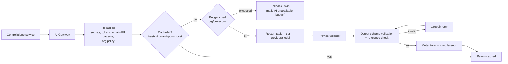

# 15 — AI Agent Architecture

**Purpose:** Specify where AI is used, how it is constrained, routed, budgeted, and kept provider-agnostic and safe.
**Related:** [05-system-architecture](./05-system-architecture.md), [09-intent-brain](./09-intent-brain.md), [13-test-generation](./13-test-generation.md), [19-security-and-safety](./19-security-and-safety.md)

## 1. Principle

AI is a **reasoning layer** invoked at a small number of well-defined decision points, with structured inputs and schema-validated outputs. The platform must remain functional (with reduced capability) when AI is disabled or unavailable.

Not an "agent loop that drives the browser". Where multi-step reasoning is needed (exploration ranking, diagnosis), the loop is **owned by deterministic code** that calls the model for a bounded sub-decision.

## 2. AI task catalogue

| Task | Input (redacted) | Output (schema) | Tier | Deterministic fallback | Phase |
|---|---|---|---|---|---|
| `intent.extract` | PR title/body, commit msgs, list of candidate flows/nodes | `IntentClaim[]` with source spans | Small | None (skip) | MVP |
| `failure.diagnose` | Failed step, expected/actual, network/console excerpt, relevant diff hunks, impact path, baseline digest, history summary | `{summary, suspectedCause, suspectedFiles[], classificationHint, confidence, citedEvidence[]}` | Large | Rule-based summary | MVP |
| `behavior.judge_freetext` | BehaviorChange + free-text claims | per-claim `{supports|contradicts|irrelevant, rationale}` | Medium | Treat as irrelevant | MVP |
| `finding.group` | Findings of a run | clusters with shared cause | Small | Group by failure signature | MVP |
| `flow.name` | UI state landmarks for a path | name, description | Small | Route-based name | MVP |
| `request.map` | Manual NL request + flow/feature list | ranked IDs | Small | Keyword match | MVP |
| `explore.rank` | State summary + candidate actions (IDs) | ranked candidate IDs | Small | Heuristic score | P2 |
| `env.detect_assist` | Config files, README excerpts | EnvironmentProfile proposal | Medium | Heuristic detector | MVP |
| `test.generate` | Flow path, UI states, intent, field rules | DSL TestDefinition | Large | Deterministic derivation | P3 |
| `plan.rerank` | Candidate tests + PR text | reordered IDs + suggested additions | Medium | Risk ordering | P3 |
| `heal.propose` | Failed locator, old/new a11y snapshots | locator candidates with evidence | Medium | Similarity heuristics | P4 |
| `visual.explain` | Diff regions + crops | explanation, severity hint | Large (vision) | Pixel stats | P4 |

"Tier" is a capability class, not a vendor: **Small** (fast, cheap extraction/classification), **Medium**, **Large** (complex reasoning, long context). ⚑ Initial model choices are an approval item.

## 3. AI Gateway

- **Provider adapters** implement `complete(messages, schema, params)`; the router maps tier → configured model per environment. Adding a provider = new adapter + config.
- **Structured output only** — JSON schema per task; outputs that reference IDs (flows, claims, candidate actions, evidence) are checked to exist in the provided input (**reference check** — prevents hallucinated IDs).
- **Prompt templates** are versioned; every AI result stores `{task, templateVersion, model, inputHash, tokens, cost}` for audit and regression evaluation.
- **Caching:** deterministic tasks at temperature 0 are cached by input hash (e.g. diagnosing the same failure signature across retries).

## 4. Data boundaries

| Data | Sent to AI? |
|---|---|
| Secrets, tokens, passwords, test-account credentials | **Never** (placeholders only) |
| Source code | Only relevant hunks/snippets (diff hunks, handler function) — and only if org `aiDataPolicy` allows code sharing; else summaries from static analysis |
| DOM / a11y snapshots | Pruned a11y tree (roles/names), text truncated, PII patterns masked |
| Network bodies | Excluded by default; status/URL pattern/timing only. Opt-in per project for JSON bodies (redacted) |
| Screenshots | Only for visual tasks (P4), opt-in |
| PR text, commit messages | Yes (redacted) |

Org-level policy: `aiDataPolicy ∈ {disabled, metadata_only, code_snippets, full}`; default `code_snippets`. Providers must be configured with zero-retention / no-training terms where available. ⚑ Regional/provider restrictions per customer are an approval item.

## 5. Guarding AI output in verdicts

- AI can **suggest** a classification (`classificationHint`), but the verdict is computed by the Verdict Engine rules ([20-test-memory](./20-test-memory.md) §5). The AI cannot upgrade `UNKNOWN` → `REGRESSION_CANDIDATE` on its own; it can supply evidence weight for free-text intent (capped, see [09-intent-brain](./09-intent-brain.md) §4).
- Diagnosis text must cite evidence IDs; uncited claims are stripped or labelled "speculative".
- Reports label AI-generated text and show confidence; language guidelines forbid certainty words ("the bug is") unless deterministic evidence exists.

## 6. Cost control

- Budgets at org (monthly), project (monthly), and run (per mode) levels; hard and soft limits.
- AI is invoked only for **non-PASS** outcomes (diagnosis), for new sources (intent extraction on content hash change), and within explicit sub-steps (explore ranking every K actions).
- Context minimization: pre-summarize with deterministic tools (impact paths, failure signatures) before any Large-tier call.
- **Hypothesis to validate:** a Smart PR run with 0–2 failures should cost well under the sandbox compute cost of the same run. Measure in Phase 1–2 and set defaults accordingly.

## 7. Evaluation

An offline eval suite is a Phase-2 exit criterion:
- Reference apps with **injected faults** (regressions), **intentional changes** (with PR descriptions), and **infra/third-party noise**.
- Metrics: classification confusion matrix (esp. false `REGRESSION_CANDIDATE`), diagnosis file-localization accuracy, intent extraction precision/recall.
- Run on every prompt-template or model change; block rollout on regression.

## 8. Open items
- Initial providers/models → Q-AI-1. Customer-supplied API keys (BYO model) → Q-AI-2.
