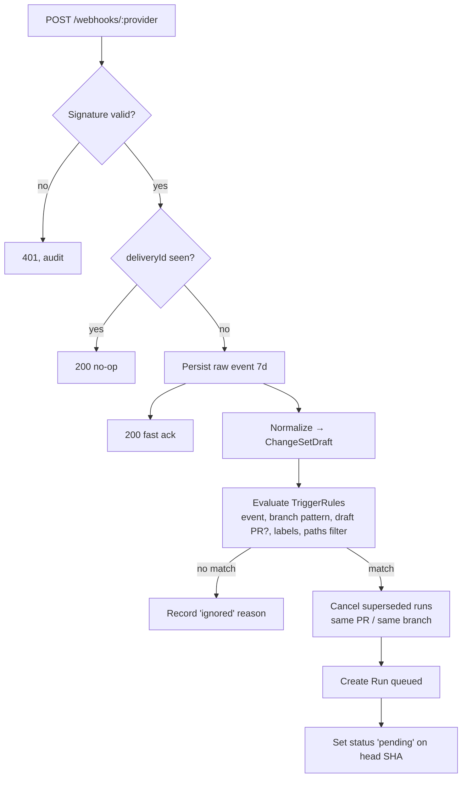

# 16 — CI/CD & Git Provider Integration

**Purpose:** Specify integration with GitHub and GitLab: connection, webhooks, trigger rules, change metadata, and result publishing.
**Related:** [05-system-architecture](./05-system-architecture.md), [12-change-impact-analysis](./12-change-impact-analysis.md), [18-evidence-and-reporting](./18-evidence-and-reporting.md), [19-security-and-safety](./19-security-and-safety.md)

## 1. Scope and recommendation

The brief asks for GitHub **and** GitLab in the initial platform. Both are designed for via the `GitProvider` interface, but ⚑ **recommendation: ship GitHub first (MVP milestone M1) and GitLab as the last MVP milestone (M4, before MVP GA)** — see [27-roadmap](./27-roadmap.md). The abstraction is built and tested with GitHub plus a GitLab contract-test fixture from day one so GitLab does not require re-architecture.

## 2. Connection model

| | GitHub | GitLab |
|---|---|---|
| Mechanism | **GitHub App** (per-org installation) | **Group/project access token** or OAuth app (gitlab.com); self-managed later |
| Permissions | Contents: read · Metadata: read · Pull requests: read & write (comments) · Checks: read & write · Commit statuses: read & write · Webhooks via App | `read_repository`, `api` (needed for MR notes & statuses — broad; document) |
| Clone | Installation access token (1 h TTL), minted per job, read-only | Project access token scoped `read_repository`, short-lived where supported (or deploy token) |
| Webhook auth | HMAC-SHA256 `X-Hub-Signature-256` | `X-Gitlab-Token` shared secret per hook |
| Events | `pull_request` (opened, synchronize, reopened, closed), `push`, `check_run.rerequested`, `issue_comment` (commands), `installation*` | `Merge Request Hook`, `Push Hook`, `Note Hook` |
| Results | **Checks API** (check run with summary, annotations) + one sticky PR comment | Commit status (`external_status`/pipelines) + one sticky MR note |

## 3. Webhook ingest



Ack within the provider's timeout; all work is async. Missed deliveries are reconciled by a periodic poll of open PRs' head SHAs for connected repos (catch-up).

## 4. Trigger rules

```yaml
# stored as TriggerRule rows; shown here as YAML for readability
triggers:
  - event: pull_request
    branches: ["*"]          # target branch filter
    skipDraft: true
    mode: smart
    blocking: false          # MVP default: informational check, not required
  - event: push
    branches: ["main"]
    mode: full_critical      # full critical regression + affected
  - event: push
    branches: ["develop"]
    enabled: false
  - event: schedule
    cron: "0 2 * * *"
    branch: main
    mode: full               # deep exploration + full regression (+ visual P4)
  - event: manual
    mode: custom
pathsIgnore: ["docs/**", "*.md"]
```

Also support an optional **repo file** `.autoqa.yml` that overrides dashboard settings (P2), so config can be code-reviewed. Precedence: repo file (at head SHA) > dashboard, except security-sensitive settings (secrets, action policy relaxations) which are dashboard-only.

Recommended defaults by trigger (from brief §51):

| Trigger | Default mode | Content |
|---|---|---|
| PR/MR | Smart | Affected flow tests, critical regression tag, derived auth/contract checks, targeted exploration if budget |
| Push → main | Full-critical | All `@critical` + affected + broader integration; updates Baselines |
| Nightly | Full | All active tests, deep exploration, shadow full-run for selection recall, visual (P4) |
| Manual | Custom | User scope: flow / feature / full |

## 5. Change metadata recorded per run

`repository, organization, branch, baseBranch, baseSha, headSha, mergeBaseSha, commit messages, PR/MR number/title/description, author, labels, changed files (+/-), changed symbols (from analysis), previous successful run on base (baseline run ID)`.

Exact commit rule: the run executes **`headSha`** for push/manual; for PRs it executes `headSha` by default. ⚑ Option to test the **merge commit** (`refs/pull/N/merge` on GitHub) to catch integration conflicts — more realistic but the SHA changes when base moves. Default: head SHA; configurable.

## 6. Publishing results

- **Status/check lifecycle:** `pending` on run creation → `in_progress` with stage text → terminal conclusion:

| Run outcome | Check conclusion |
|---|---|
| All PASS / EXPECTED_CHANGE | `success` |
| Any REGRESSION_CANDIDATE (non-advisory test) | `failure` if `blocking`, else `neutral` with summary |
| Only UNKNOWN pending confirmation | `action_required` (GitHub) / `failed` with "needs confirmation" (GitLab: `failed` is ambiguous → use `success` + comment? ⚑ see Q-CI-2) |
| INFRA_FAILURE | `neutral` + "platform could not run your app" guidance |
| Cancelled/superseded | `cancelled` |

- **Sticky comment:** one per PR, updated in place (identified by hidden marker). Content in [18-evidence-and-reporting](./18-evidence-and-reporting.md) §5.
- **Comment commands** (`/qa rerun`, `/qa intentional <id> <reason>`, `/qa false-positive <id> <reason>`, `/qa full`): only accepted from users with write access to the repo (verified via provider API); every command is audited.

## 7. CI-pipeline trigger (future, P4)

Some teams want the QA run as a step in their own pipeline (e.g. after deploying a preview environment). Provide:
- A CLI/Action (`autoqa run --wait`) that calls `POST /runs` with the commit and optional **external target URL** (preview deployment) and polls for result.
- In that mode the sandbox runs **only the browser** against the provided URL (no app build). The environment classification must be `staging`/`preview`; never `production`.

## 8. Rate limits and resilience
- Respect provider rate limits with per-installation token buckets; queue status updates; coalesce comment updates (≤1 per 10 s per PR).
- Provider outage: runs continue; publishing retried with backoff; dashboard remains source of truth.

## 9. Open items
- GitLab at M1 or M4 → Q-CI-1. GitLab "needs confirmation" status mapping → Q-CI-2. Merge-commit vs head testing default → Q-CI-3. Blocking checks default → Q-CI-4.
