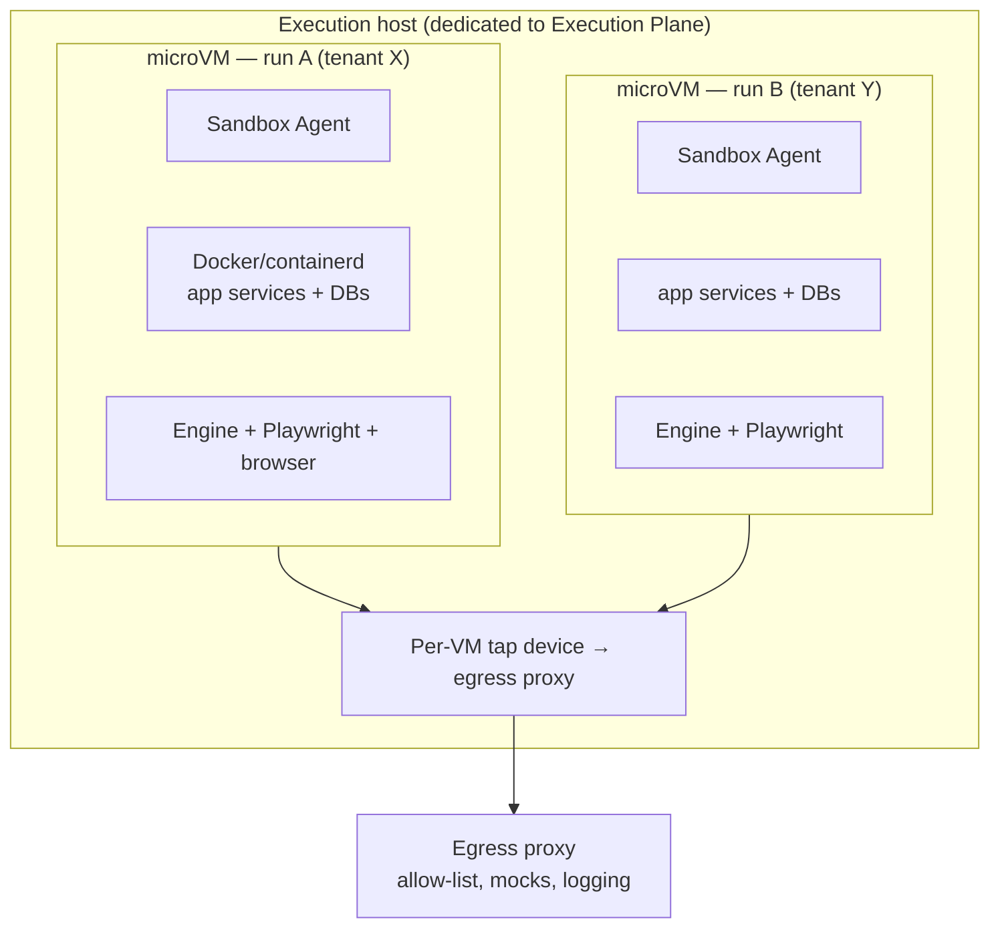
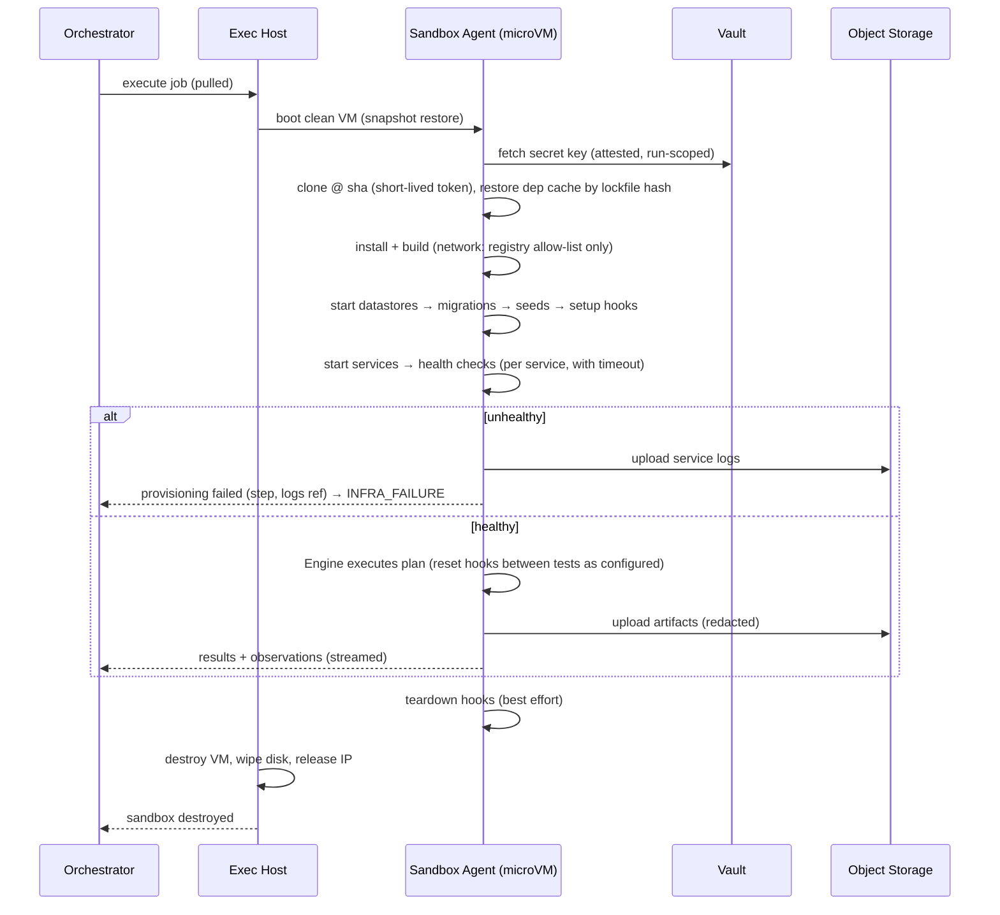

# 17 — Cloud Execution

**Purpose:** Specify the job pipeline, sandbox isolation, environment detection, and environment lifecycle for running untrusted applications and tests.
**Related:** [05-system-architecture](./05-system-architecture.md), [06-deployment-architecture](./06-deployment-architecture.md), [14-playwright-engine](./14-playwright-engine.md), [19-security-and-safety](./19-security-and-safety.md), [21-test-data-management](./21-test-data-management.md)

## 1. Job pipeline

Separate queues per stage so each scales and fails independently.

| Queue | Consumer | Zone | Timeout (default, tunable) |
|---|---|---|---|
| `analyze` | Analysis worker | 2 | 10 min |
| `plan` | Planner worker | 1 | 2 min |
| `execute` | Execution host (sandbox) | 3 | Run budget + 15 min setup |
| `evaluate` | Comparator + AI diagnosis | 1 | 10 min |
| `publish` | Reporter | 1 | 2 min, retried |
| `brain-maintenance` | Re-snapshot, compaction, retention | 1/2 | — |

- Jobs are idempotent by `(runId, stage, attempt)`; stage results are written before ack.
- **Fair scheduling:** per-org and per-project concurrency caps; priority: manual > PR > push > schedule; weighted fair queuing across orgs to prevent one tenant starving others.
- **Supersession:** a newer push to the same PR cancels queued/running jobs for older SHAs (configurable).
- **Heartbeats:** execution hosts heartbeat per run; missing heartbeats for 2 min → run marked `infra_failed`, sandbox force-destroyed.

## 2. Worker contract (execute job)

Received from the control plane (pulled over mTLS job API):
```json
{
  "runId": "run_123", "projectId": "prj_9", "orgId": "org_1",
  "repo": { "provider": "github", "cloneUrl": "...", "sha": "a1b2c3", "cloneToken": "<short-lived>" },
  "envProfile": { "version": 7, "...": "..." },
  "secretsBundle": { "wrappedKey": "...", "ciphertext": "...", "expiresAt": "..." },
  "plan": { "items": [], "exploration": [] },
  "policy": { "actionPolicyVersion": 3, "egress": { "allow": ["api.stripe.com"], "mocks": [] } },
  "budget": { "maxMinutes": 20, "maxActions": 500 },
  "upload": { "presignedPrefix": "...", "expiresAt": "..." }
}
```
Secrets are delivered encrypted, decrypted inside the microVM with a one-time key obtained from the vault using the run's attestation token; the bundle expires with the run.

## 3. Isolation model

⚑ **Recommendation: one Firecracker-class microVM per run.**



Why not plain containers: the app itself is typically multi-container (docker-compose), which requires a Docker daemon inside the sandbox — nesting Docker in a shared-kernel container is either privileged (unsafe) or fragile. A microVM gives a separate kernel per run with modest overhead.

| Option | Isolation | Startup | Ops cost | Verdict |
|---|---|---|---|---|
| Container per run (shared kernel) | Weak for untrusted multi-container apps | Fast | Low | ✗ |
| gVisor/Kata containers | Medium–strong | Fast–medium | Medium | Viable alternative (Kata ≈ microVM) |
| **Firecracker microVM per run** | Strong | Medium (snapshot restore helps) | Medium–high | **Recommended** |
| Cloud VM per run (warm pool) | Strong | Slow (minutes) unless pooled | Low–medium | **MVP fallback** if microVM ops is too heavy |
| Kubernetes | Orchestration, not isolation | — | High | Later, as a scheduler for hosts, if needed |

**Never reuse a sandbox across runs or tenants.** Warm pools contain *clean, pre-booted* VMs restored from a golden snapshot, never previously used ones.

## 4. Environment auto-detection (Zone 2)

Detection order and what each yields:

| Source | Yields |
|---|---|
| `docker-compose*.yml` | Services, images/builds, ports, depends_on, datastores (mongo/postgres/redis) — **preferred** when present |
| `Dockerfile`s | Build per Application |
| `package.json` scripts, workspaces, `turbo.json`, `nx.json`, `pnpm-workspace.yaml` | Package manager, build/start commands per app (`dev`, `start`, `build`), monorepo layout |
| Framework conventions | Next.js (`next build && next start`, port 3000), NestJS (`nest start`), Vite (`vite preview`) |
| CI config (`.github/workflows`, `.gitlab-ci.yml`) | Service containers (DB versions), env var names, test commands |
| `.env.example` | Required env var names (values never auto-guessed for secrets) |
| README | Start instructions (AI-assisted parse, **medium tier**, proposal only) |
| ORM config | DB kind; migration and seed commands (`prisma migrate deploy`, `prisma db seed`) |

Output: a proposed EnvironmentProfile with per-field `source` and confidence. The user **confirms** it during onboarding (a failed first start shows the exact failing step + logs and lets them edit).

## 5. Sandbox lifecycle



Phases are individually timed and reported; startup failures are a top onboarding metric.

## 6. Performance levers (to reach acceptable time-to-feedback)
- **Dependency cache**: per-project, keyed by lockfile hash, stored in execution-plane object storage, mounted read-only then copied; never shared across orgs.
- **Build cache**: framework caches (`.next/cache`, turbo cache) per project, keyed by branch + lockfile.
- **Base images**: pre-pulled common images (node LTS, mongo, postgres, redis) in golden VM snapshot.
- **Parallelism**: split a large plan across multiple sandboxes (each brings up its own stack) when estimated duration > threshold (P2).
- **Overlap**: start provisioning while analysis/planning complete.

**Hypothesis:** for a typical Next.js + API + DB project with warm caches, sandbox-to-healthy within a few minutes. Must be measured in Phase 1 before committing to any time-to-feedback NFR.

## 7. Long-running jobs
- Run budgets cap wall-clock; nightly runs may be split into shards.
- Progress is checkpointed per test; a lost sandbox mid-run marks remaining tests `not_run (infra)` rather than failing them, and completed results are kept.
- No sandbox outlives its hard TTL (default: budget + 30 min), enforced by the host.

## 8. Open items
- microVM vs pooled cloud VMs for MVP → Q-EXE-1. Cloud provider → Q-EXE-3. Repo-defined dev services not containerized (e.g. requires macOS) → unsupported, document.
