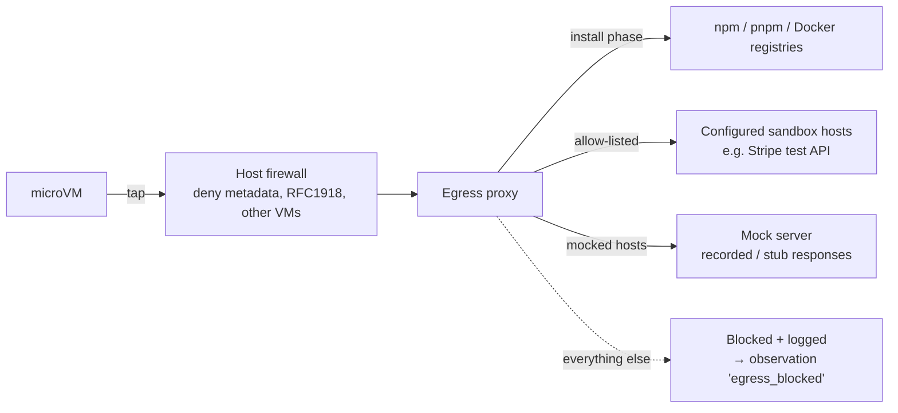

# 19 — Security & Safety Model

**Purpose:** Define tenant isolation, repository access, secret handling, sandbox isolation, AI data boundaries, dangerous-action safety, audit, retention, and deletion.
**Related:** [05-system-architecture](./05-system-architecture.md) §2, [17-cloud-execution](./17-cloud-execution.md), [15-ai-agent-architecture](./15-ai-agent-architecture.md) §4, [22-data-model](./22-data-model.md)

## 1. Threat model (summary)

| Asset | Threats | Primary controls |
|---|---|---|
| Customer source code | Cross-tenant read; exfiltration by a malicious repo in shared infra; leakage to AI providers | Zone separation, per-run microVM, per-org keys, AI data policy |
| Customer secrets (test creds, API keys) | Leakage into logs/artifacts/AI; theft via sandbox escape; misuse beyond run | Vault, run-scoped encrypted bundles, redaction, egress control, no secrets in Zones 1(services)/2 |
| Git provider tokens | Over-scoped access; token theft | GitHub App least privilege; short-lived installation tokens; minted per job |
| Platform control plane | Compromise via malicious repo content (parser exploits, crafted webhook payloads) | No parsing in Zone 1; schema-validated facts; webhook signature verification |
| Third parties reached by tests | Real payments/emails; abuse of customer's vendor accounts | Default-deny egress, sandbox/mocks, ActionPolicy |
| Customer's own environments | Accidental testing of production | Environment classification; production forbidden in MVP |
| Evidence | Contains PII / screenshots of sensitive data | Redaction, per-org encryption, signed URLs, retention |

Attacker personas: malicious tenant (uploads a hostile repo), compromised developer account in a tenant, external attacker, curious insider.

## 2. Requirements

| ID | Requirement | Phase |
|---|---|---|
| SEC-1 | Every persisted record carries `orgId`; all queries are scoped by a tenancy guard in the data-access layer; Postgres row-level security as defense in depth ⚑ | MVP |
| SEC-2 | Control Plane services never clone, parse, build, or run repository code | MVP |
| SEC-3 | Analysis Tier runs in gVisor-class sandboxes with no secrets, no egress except the git provider host, CPU/mem/disk/file-count limits, and symlink/zip-bomb protection | MVP |
| SEC-4 | Execution runs in a fresh microVM per run; no reuse across runs or tenants; hard TTL | MVP |
| SEC-5 | Execution Plane and Analysis Tier are in separate cloud accounts/projects from the Control Plane; they reach it only via an mTLS job API with per-worker identity | MVP |
| SEC-6 | Sandbox egress default-deny; allow-list = package registries (during install phase only), project-configured hosts; all egress logged | MVP |
| SEC-7 | Sandbox has no access to cloud metadata endpoints or internal networks | MVP |
| SEC-8 | Secrets encrypted with per-project data keys (KMS envelope); plaintext only inside the vault service and the target microVM | MVP |
| SEC-9 | Secrets are write-only in UI/API (never readable back); rotation supported; access audited | MVP |
| SEC-10 | Secret values are masked in logs, observations, artifacts (value-based redaction of known secrets + pattern-based for tokens/keys) before leaving the sandbox | MVP |
| SEC-11 | Secrets are never included in AI inputs (`{{secret.X}}` placeholders only); `exposeToAI` flag exists but defaults false and requires org admin | MVP |
| SEC-12 | Git provider access uses GitHub App least-privilege permissions; clone tokens ≤ 1 h and minted per job | MVP |
| SEC-13 | Webhooks verified (HMAC/token); replay-protected by delivery ID; payload size capped | MVP |
| SEC-14 | Production-classified targets cannot be tested in MVP; external-URL mode (P4) requires `staging`/`preview` class and an ownership verification (DNS TXT or file token) | MVP/P4 |
| SEC-15 | ActionPolicy enforced by Execution Engine (not AI); platform default deny list cannot be removed, only relaxed for ephemeral sandboxes with mocks | MVP |
| SEC-16 | Audit log (append-only) for: auth events, membership changes, secret create/update/access, config changes, policy relaxations, resolutions, AI data policy changes, data deletion | MVP |
| SEC-17 | Artifacts accessible only via authz-checked short-lived signed URLs; no public buckets | MVP |
| SEC-18 | Data retention and deletion policy per org; deletion propagates to DB, object storage, caches, and AI-cache within a defined window | MVP |
| SEC-19 | Platform user auth via GitHub/GitLab OAuth; SSO/SAML P3; MFA enforced via IdP | MVP / P3 |
| SEC-20 | Role-based access: owner/admin (config, secrets, policy), member (run, resolve), viewer (read) | MVP |
| SEC-21 | Comment commands authorized against provider repo permission (write+) | MVP |
| SEC-22 | Dependency caches, build caches, and warm pools are never shared across orgs | MVP |

## 3. Sandbox network design

Egress logs are an evidence source for third-party-failure attribution and for detecting apps that silently depend on unlisted services.

## 4. Dangerous-action safety

Layers (all must pass):
1. **Environment class**: only `ephemeral` sandboxes (and later `staging` with verification). No production.
2. **Egress**: real payment/email/SMS providers are blocked unless the project configures their **sandbox** endpoints (e.g. Stripe test keys) or mocks.
3. **ActionPolicy**: deny/approval rules on UI actions and resulting HTTP methods/paths (e.g. `DELETE /api/users/*` from exploration → deny).
4. **Exploration restraint**: destructive-pattern controls excluded from candidate actions by default.
5. **Test accounts only**: platform never logs in with personal/production accounts; TestAccounts are explicit.

CAPTCHA and production 2FA are **never bypassed**. Supported mechanisms: test-mode CAPTCHA keys (e.g. provider test site keys), feature flags that disable CAPTCHA in test env, TOTP secrets for dedicated test accounts stored as secrets, pre-authenticated storage state. See [21-test-data-management](./21-test-data-management.md) §2.

## 5. AI data boundaries
See [15-ai-agent-architecture](./15-ai-agent-architecture.md) §4. Summary: org-level `aiDataPolicy`; redaction in gateway; no secrets; code snippets only as allowed; providers under no-training/zero-retention terms where available; AI calls audited with input hashes (not full content by default).

## 6. Retention & deletion

| Data | Default retention (proposal ⚑) |
|---|---|
| Runs, results, findings, resolutions (metadata) | 13 months |
| Artifacts `standard` (screenshots, traces on failure, network logs) | 30 days |
| Artifacts `short` (videos, pass traces, service logs) | 7 days |
| Baseline evidence | While baseline live + 30 days |
| Raw webhook payloads | 7 days |
| Repository clones / caches | Clones: destroyed with sandbox; dependency caches: 14 days since last use |
| Audit log | 13 months (configurable longer for enterprise) |
| AI gateway cache | 7 days |

Org deletion: soft-delete (7 days), then hard-delete across DB, object storage (prefix delete), caches, vault keys (crypto-shredding by destroying per-org keys).

## 7. Compliance posture
Target SOC 2 Type II readiness by GA (controls mapped to SEC-*). GDPR: DPA, sub-processor list (incl. AI providers), data residency options P5.

## 8. Open items
- Row-level security vs app-only scoping → Q-SEC-1. Retention defaults → Q-DATA-1. Ownership verification for external URLs → Q-SEC-2.
