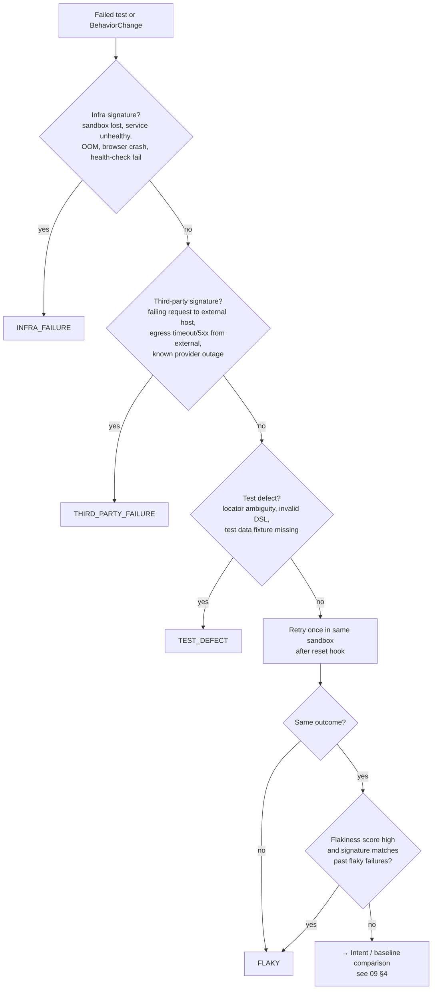

# 20 — Test Memory, Baselines & Verdict Engine

**Purpose:** Specify historical test memory, baselines, flakiness detection, noise classification, the verdict rules, and the developer feedback loop.
**Related:** [07-domain-model](./07-domain-model.md) §3.7, [09-intent-brain](./09-intent-brain.md), [18-evidence-and-reporting](./18-evidence-and-reporting.md)

## 1. What Test Memory stores

- TestDefinitions and versions; TestResults per run (with attempts).
- **Baselines** per `(subject, branch)`.
- Rolling stats per test: pass/fail history (per branch), duration distribution, flakiness score, last failure signature(s).
- Findings (with fingerprints) and Resolutions.
- External-service health history (from egress proxy outcomes).
- Per-project calibration parameters (thresholds by dimension).

## 2. Baselines

A Baseline is an **observation digest** of an accepted run:

```json
{
  "subject": { "testDefinitionId": "td_booking_happy" },
  "branch": "main", "commitSha": "9f1c2e", "runId": "run_100",
  "digest": {
    "flowSequence": ["ui_state:aa12", "ui_state:bb34", "ui_state:cc56", "ui_state:dd78"],
    "endpoints": [{ "method": "POST", "path": "/api/booking", "status": 201, "schemaHash": "s_91" }],
    "assertions": [{ "step": 7, "outcome": "passed" }],
    "consoleErrorSignatures": [],
    "uiLandmarks": { "ui_state:dd78": ["heading:Booking confirmed", "button:View booking"] },
    "timingP50": { "total_ms": 8100 }
  },
  "acceptedBy": "auto_green_on_branch"
}
```

**Update rules**
- Auto-update on default branch when the run's verdict for that subject is `PASS` or `EXPECTED_CHANGE` (with a Decision), and the run is not flaky-tagged.
- PR runs never update canonical baselines. PR-scoped Decisions mark the baseline "pending replacement"; replacement happens on the first green default-branch run after merge.
- User can accept a run's observation as baseline explicitly (audited).

**No baseline yet** (new flow/test, first run): verdicts come from assertions + intent only; behavior-change detection is skipped for that subject and the report says so.

## 3. Behavior-change detection (dimensions)

Comparator compares the current observation to the Baseline digest per dimension:

| Dimension | Change detected when | Noise tolerance |
|---|---|---|
| `flow_sequence` | Ordered UI-state fingerprints differ (edit distance > 0) | Near-duplicate states merged |
| `http_status` | Status class differs for a matched endpoint (2xx→4xx/5xx or vice versa) | — |
| `api_shape` | Response schema hash differs (keys/types, not values) | Ignore configured volatile fields |
| `ui_structure` | Landmarks / interactive elements added/removed on a state | Minor text changes ignored |
| `console_errors` | New error signatures (normalized message + source) | Known third-party signatures ignored |
| `auth_behavior` | Protected route now accessible (or vice versa) for a role | — |
| `timing` | P50 > k× baseline (k default 3) | Report only; never regression by itself |
| `visual` (P4) | Perceptual diff above threshold in unmasked regions | Masks, antialias tolerance |

## 4. Noise classification (before intent comparison)



Third-party attribution requires evidence from the egress proxy (the failing chain includes an external call that failed) — not merely the presence of a third-party SDK in the path.

## 5. Verdict rules (deterministic)

| Verdict | Conditions (all) |
|---|---|
| `PASS` | All assertions passed; no BehaviorChange, or only `timing` changes |
| `EXPECTED_CHANGE` | BehaviorChange(s) present; intent evaluation `S ≥ θe`, `C < θc`; no failed assertion outside changed scope |
| `REGRESSION_CANDIDATE` | (a) Failed assertion in an `active`, non-quarantined, non-advisory test with no supporting intent for the change; **or** (b) BehaviorChange with `C ≥ θr`; **or** (c) hard-failure dimension (5xx, new page error, auth boundary loosened) contradicting baseline — and noise classification ruled out infra/3P/flaky/test-defect |
| `UNKNOWN` | BehaviorChange without sufficient support or contradiction; conflicting intent; advisory test failed |
| `FLAKY` | §4 |
| `INFRA_FAILURE` / `THIRD_PARTY_FAILURE` / `TEST_DEFECT` | §4 |

**Confidence** of a verdict is `high|medium|low`, computed from: baseline strength (pass streak length), intent weight margin, noise-check completeness (retry done?), and evidence completeness. `REGRESSION_CANDIDATE` with `low` confidence is displayed as `UNKNOWN` by default (per-project setting) — this is a deliberate false-positive guard.

## 6. Calibration from feedback

For each project and dimension, track resolution outcomes:

`precision_regression = CONFIRMED_REGRESSION / (CONFIRMED_REGRESSION + FALSE_POSITIVE)`

- If precision for a dimension falls below target (hypothesis 0.8) over the last N (≥10) resolutions → raise `θr` for that dimension and demote future low-margin cases to `UNKNOWN`.
- If `UNKNOWN`s in a dimension are consistently resolved `INTENTIONAL` → raise weight of PR-description intent for this project.
- All calibration changes are logged and visible in project settings (explainability).

## 7. Flakiness

- **Flakiness score** per test: exponentially weighted rate of *outcome flips on the same SHA* (retry disagreement) plus pass/fail alternation on unchanged covered code across runs.
- Threshold → `quarantined` (still runs, non-blocking, results tagged). Leaves quarantine after M consecutive stable runs.
- Recorded cause hints (deterministic): timing-sensitive waits, network variance to externals, animation, random data, environment instability (sandbox resource saturation metrics), order dependence (fails only when run after test X).
- AI may summarize likely cause for a flaky test (P2), citing evidence.

## 8. History example

```
Test: Booking Flow (main)
  A 7c1 PASS
  B 8d2 PASS
  C 9e3 FAIL  POST /api/booking 500  → REGRESSION_CANDIDATE → CONFIRMED_REGRESSION (fixed in D)
  D a0f PASS
```
Used for: regression detection (C vs B), recurring failure detection (same fingerprint reappearing), risky modules (confirmed regressions per node), unstable dependencies (3P failures per external host).

## 9. Finding fingerprint and dedupe
`fingerprint = hash(verdict, subject, dimension, normalized failure signature, top changed file)` — used to (a) avoid re-asking the same question on every push of a PR, (b) carry over resolutions when the same finding reappears on a new SHA of the same PR, (c) detect recurrence on main.

## 10. Open items
- Retry-once default for all failures vs. only on suspect signatures → Q-TST-3.
