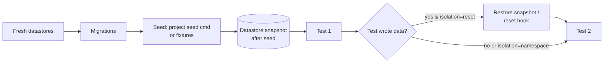

# 21 — Test Data Management

**Purpose:** Specify test accounts, authentication, seed data, isolation, reset strategy, generated data, and third-party service handling.
**Related:** [17-cloud-execution](./17-cloud-execution.md), [14-playwright-engine](./14-playwright-engine.md), [19-security-and-safety](./19-security-and-safety.md)

## 1. Principles
- Each run starts from a **known data state** (fresh datastores in the sandbox + migrations + seeds).
- Tests must not depend on each other's side effects unless explicitly chained.
- Data is **deterministic** where possible (seeded generators), and every generated value is recorded in the step log for reproducibility.
- The platform never needs production data.

## 2. Test accounts and authentication

| Strategy | How | Use when |
|---|---|---|
| `form` | Engine runs the account's login flow (DSL) with `{{secret.*}}` credentials; saves storageState | Standard username/password |
| `storage_state` | User uploads a Playwright storageState (encrypted secret); injected per context | SSO/OAuth where test IdP not available (expires; warn on expiry) |
| `api_token` | Setup step calls a login API or sets `Authorization` header via route interception | API-first apps |
| `cookie` | Set session cookie from secret | Legacy apps |
| `seeded_user` | Seed script creates the user in the sandbox DB; credentials from project config | Preferred for ephemeral sandboxes |
| OAuth test IdP (P3) | Mock OIDC provider in sandbox (e.g. a local OIDC server) with the app configured to trust it | Apps using OAuth login |

Login is performed once per role per sandbox and reused via storageState across tests (re-login on 401 detection).

**2FA/CAPTCHA:** never bypassed. Supported: TOTP secret for test account (engine computes code), provider test keys for CAPTCHA, test-env feature flags. If a login shows a CAPTCHA the platform cannot legitimately pass, the run reports `TEST_DEFECT: authentication blocked` with guidance.

## 3. Data lifecycle in a run

**Isolation strategies** (per project, per test override):

| Strategy | Mechanism | Cost | Parallel-safe |
|---|---|---|---|
| `reset` (default) | Restore datastore snapshot between tests (Postgres template DB / `pg_dump` restore; Mongo `mongorestore` of seeded dump; Redis `FLUSHALL` + reload) or run project `reset` hook | Medium | No (serial per sandbox) |
| `namespace` | Each test uses unique generated entities (unique email/tenant/slug); no reset | Low | Yes |
| `sandbox_per_shard` | Separate sandbox per parallel shard | High | Yes |
| `none` | User asserts tests are independent | Lowest | User responsibility |

Reset strategies are detected from datastore kind; custom hooks allowed (`setup`, `reset`, `teardown` commands executed inside the sandbox).

## 4. Seed data

Sources in order: project seed command (`prisma db seed`, `npm run seed`) → platform fixtures file (`.autoqa/fixtures/*.json`, P2) → exploration-created data (not persisted across runs).

Fixtures are referenced from tests by name (`$fixture: "activity.available"`) — a fixture resolver queries the seeded data (via a project-provided fixture query, or a recorded entity from setup steps) so tests don't hard-code IDs.

## 5. Generated input data
Generators: `$email` (unique, `+runId` suffix, test domain), `$name`, `$phone` (reserved test ranges), `$uuid`, `$date(offset|next_available)`, `$int(min,max)`, `$string(len, charset)`, `$card(test_visa|test_decline)` (only provider test numbers), boundary generators from field rules. All seeded by `runSeed` recorded on the Run.

## 6. Third-party services

| Mode | Behavior | Default for |
|---|---|---|
| `sandbox` | Allow egress to provider's test environment using test keys | Payments (Stripe test mode), if configured |
| `mock` | Egress proxy routes host to platform mock server with stub/recorded responses | Email/SMS providers, analytics, maps tiles |
| `record_replay` (P3) | Record from sandbox provider on main, replay on PRs | Flaky or rate-limited external APIs |
| `block` | Requests fail fast; logged | Unknown hosts (default) |
| `allow` | Pass-through (requires explicit admin config, audited) | Rare, e.g. public read-only APIs |

Email capture: a mock SMTP/HTTP email sink in the sandbox (e.g. MailHog-class) so tests can assert "confirmation email sent" without sending real email. Sink content is evidence.

Health information: for `sandbox`/`allow` hosts, the egress proxy records latency/errors per host → Test Memory external-service health, used for `THIRD_PARTY_FAILURE` attribution. Optional status-page polling for major providers (P3).

## 7. Open items
- Platform fixture format → Q-DATA-4. OAuth mock IdP support timing → Q-TST-4.
