# 24 — Data Flow Diagrams

**Purpose:** Context, Level 1, and Level 2 DFDs.
**Related:** [05-system-architecture](./05-system-architecture.md), [25-sequence-diagrams](./25-sequence-diagrams.md)

**Notation (Mermaid):** `[Rectangle]` external entity · `([Stadium])` process · `[(Cylinder)]` data store · edge labels are data flows. Trust-zone subgraphs are shown where relevant.

---

## 1. Context DFD (Level 0)

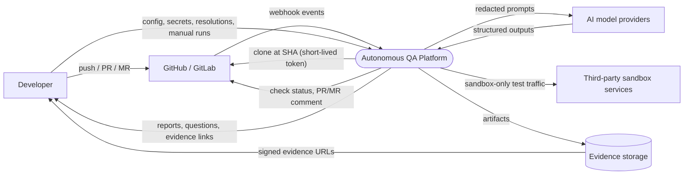

The "Cloud Test Runner" from the brief is internal to the platform (Execution Plane) and appears at Level 1.

---

## 2. Level 1 DFD

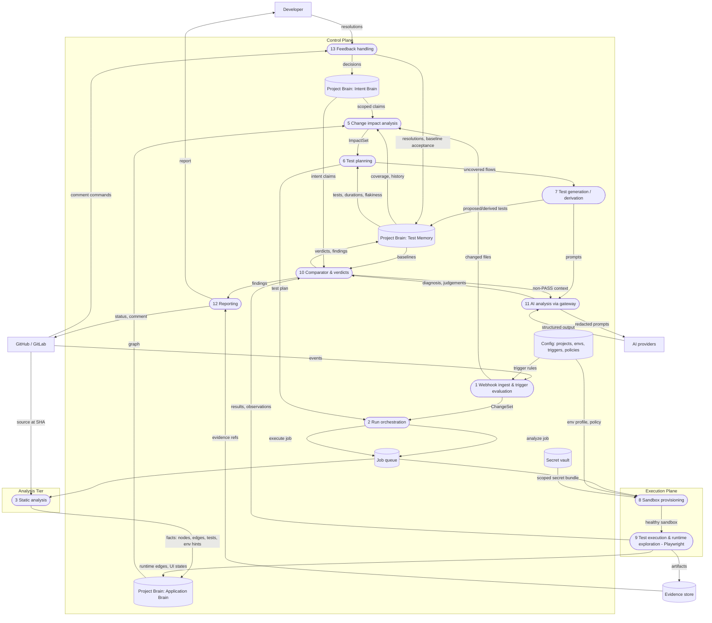

---

## 3. Level 2 DFDs

### 3.1 Repository ingestion (onboarding)

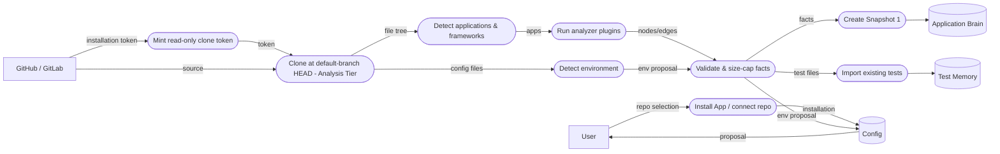

### 3.2 Git diff analysis

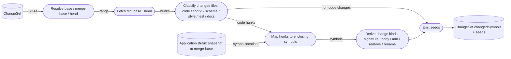

### 3.3 Project Brain synchronization

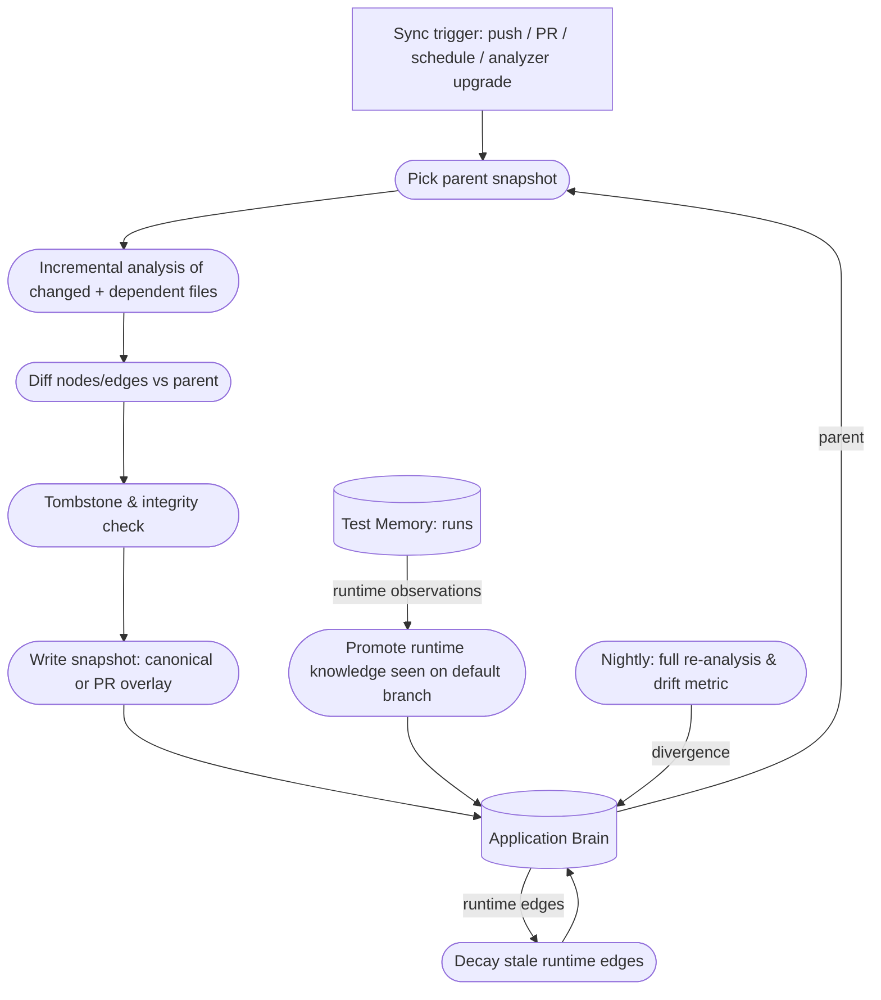

### 3.4 Runtime exploration

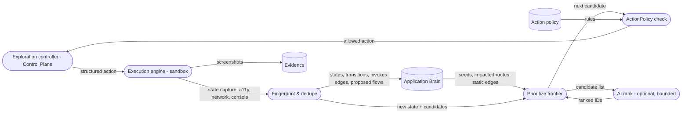

### 3.5 Application graph construction

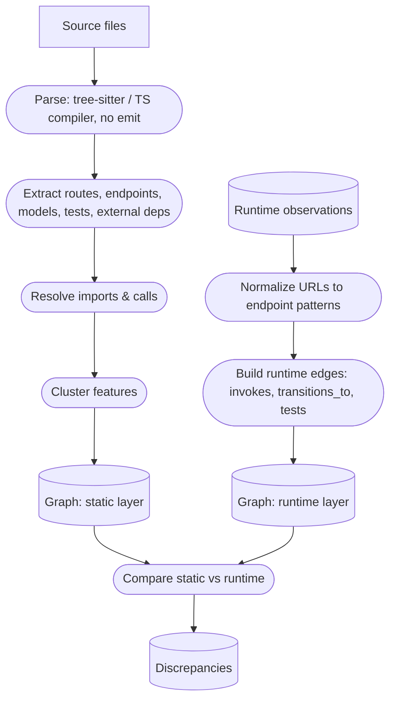

### 3.6 Change-impact analysis

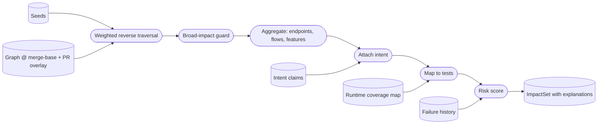

### 3.7 Test execution

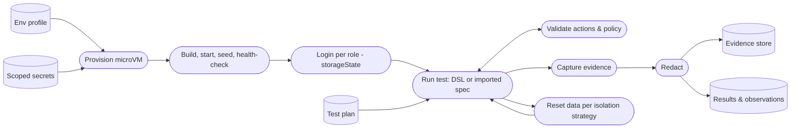

### 3.8 Failure analysis

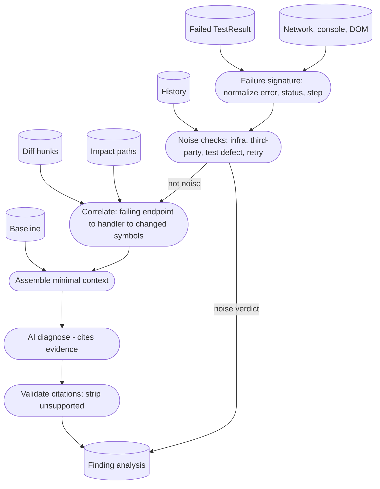

### 3.9 Behavior-change classification

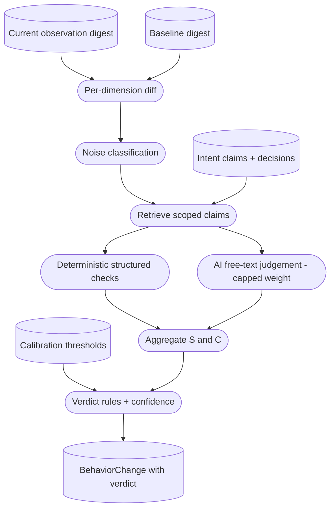

### 3.10 Developer confirmation

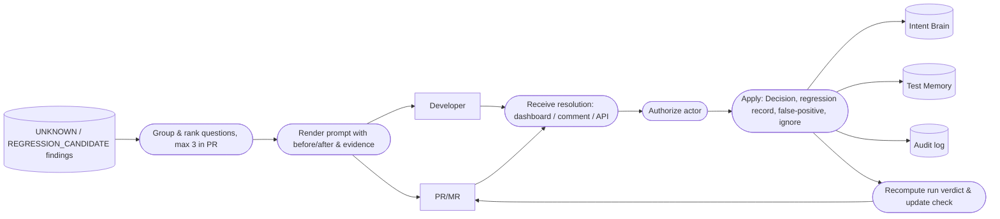
