# 25 — Sequence Diagrams

**Purpose:** Key interaction sequences across components.
**Related:** [24-high-level-dfd](./24-high-level-dfd.md), [05-system-architecture](./05-system-architecture.md)

Participant abbreviations: **Dev** developer · **UI** dashboard · **API** control-plane API · **GH/GL** GitHub/GitLab · **WH** webhook ingest · **ORC** run orchestrator · **Q** job queue · **AN** analysis worker (Zone 2) · **BR** Project Brain service · **IMP** impact analyzer · **PL** planner · **EX** execution host / sandbox agent (Zone 3) · **EN** execution engine + Playwright · **CMP** comparator/verdict engine · **AIG** AI gateway · **REP** reporter · **V** vault · **S3** object storage.

---

## 1. New project onboarding

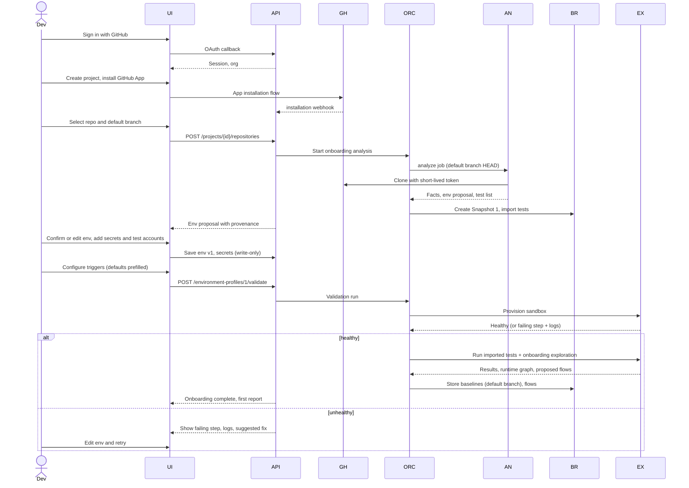

## 2. Existing project synchronization

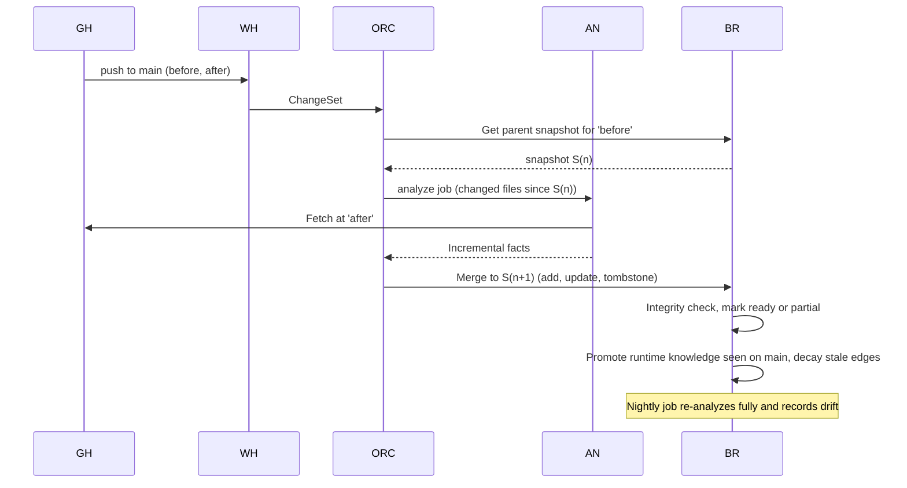

## 3. GitHub pull request

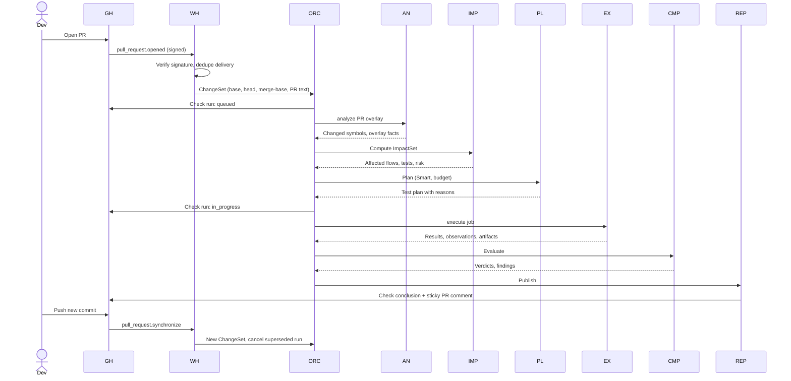

## 4. GitLab merge request

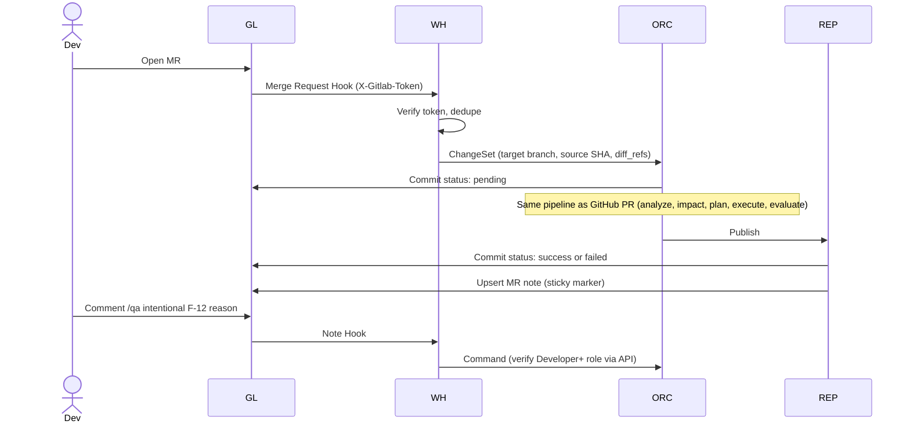

## 5. Push to main

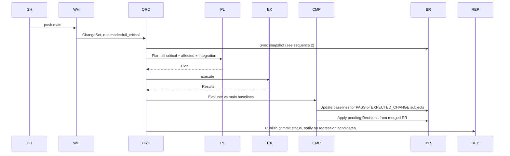

## 6. Developer code change (end-to-end impact view)

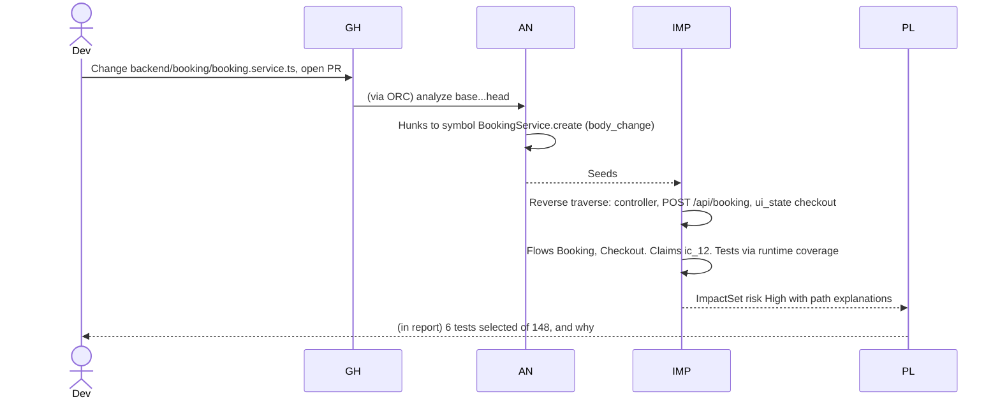

## 7. Smart test run

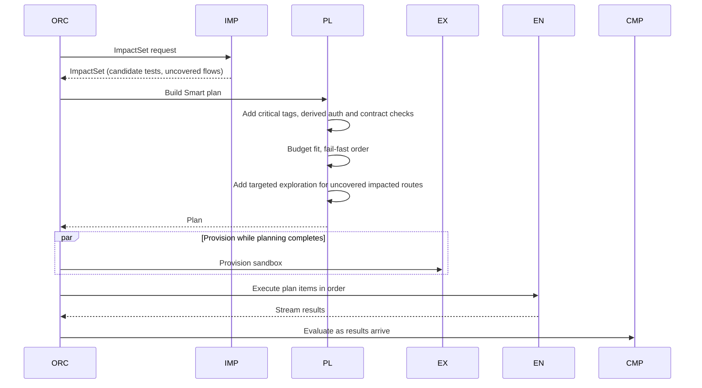

## 8. Full test run

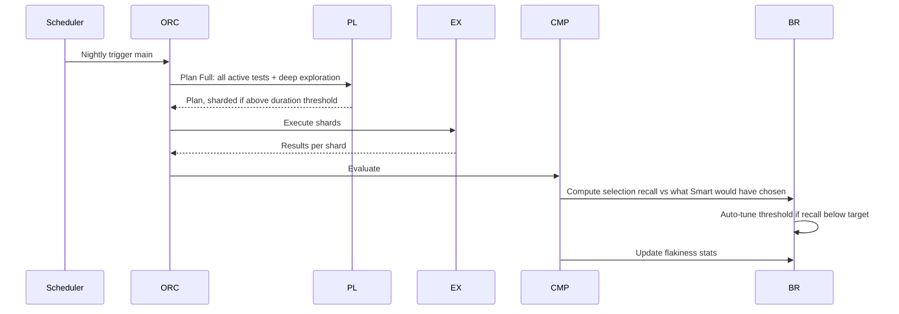

## 9. Runtime exploration

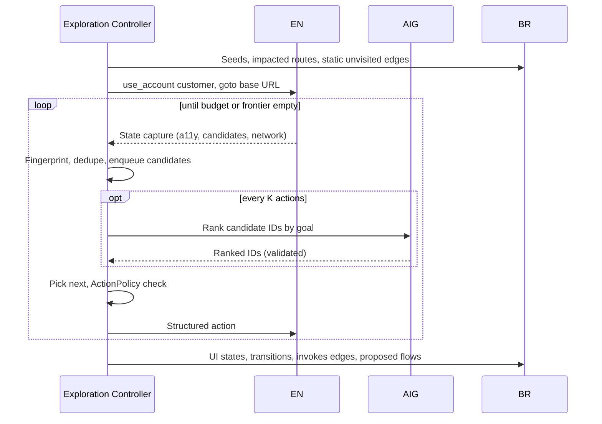

## 10. Behavior change detection

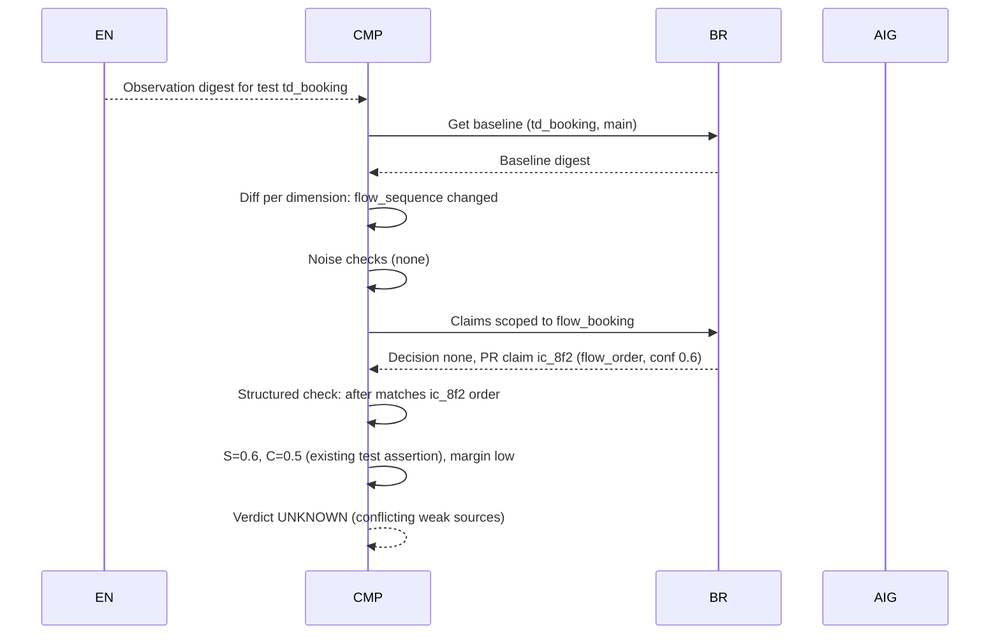

## 11. Unknown behavior requiring developer confirmation

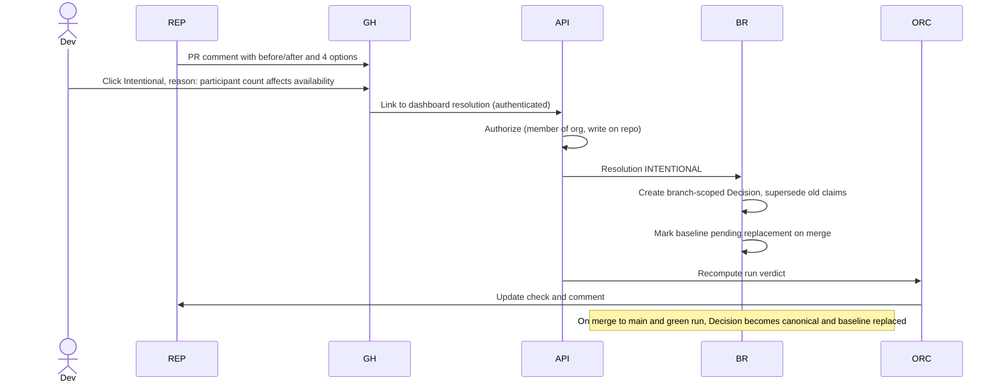

## 12. Test failure analysis

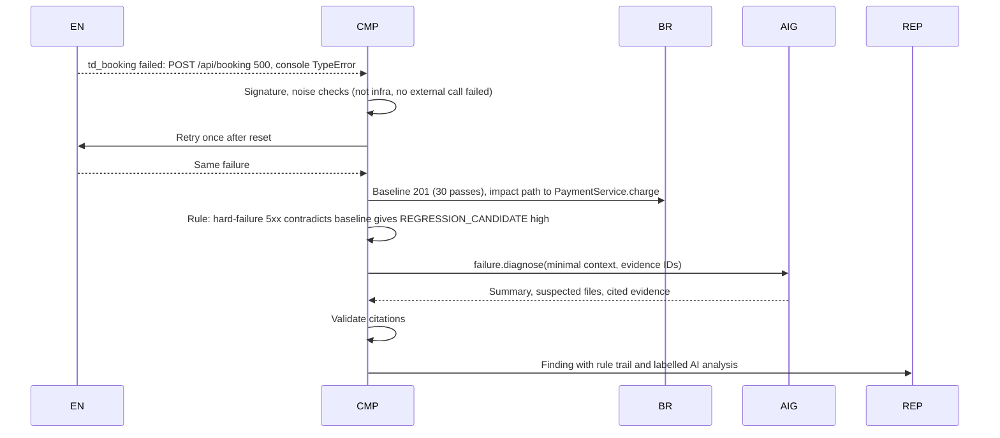

## 13. Self-healing proposal (P4)

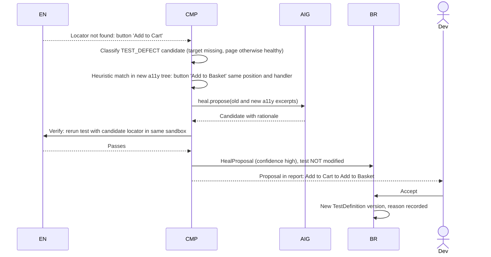

## 14. CI/CD execution (pipeline step, P4)

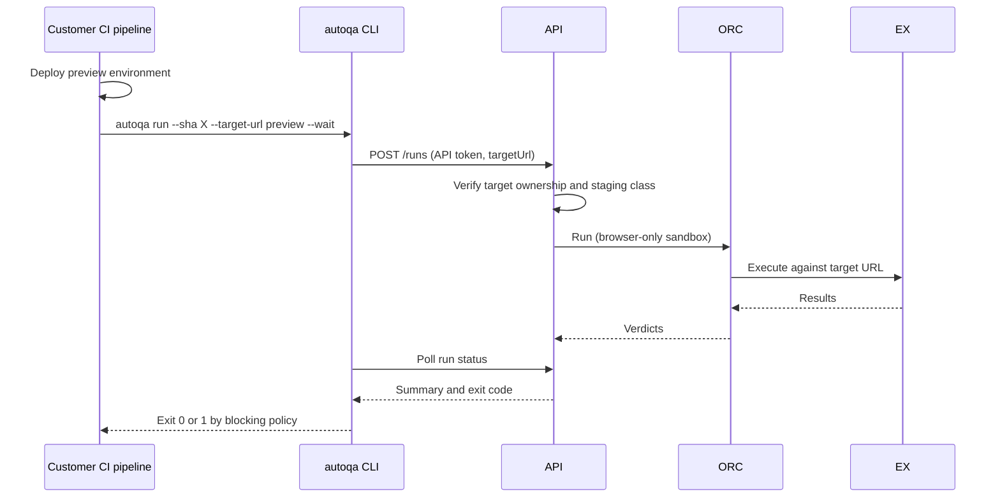

## 15. Test environment creation and destruction

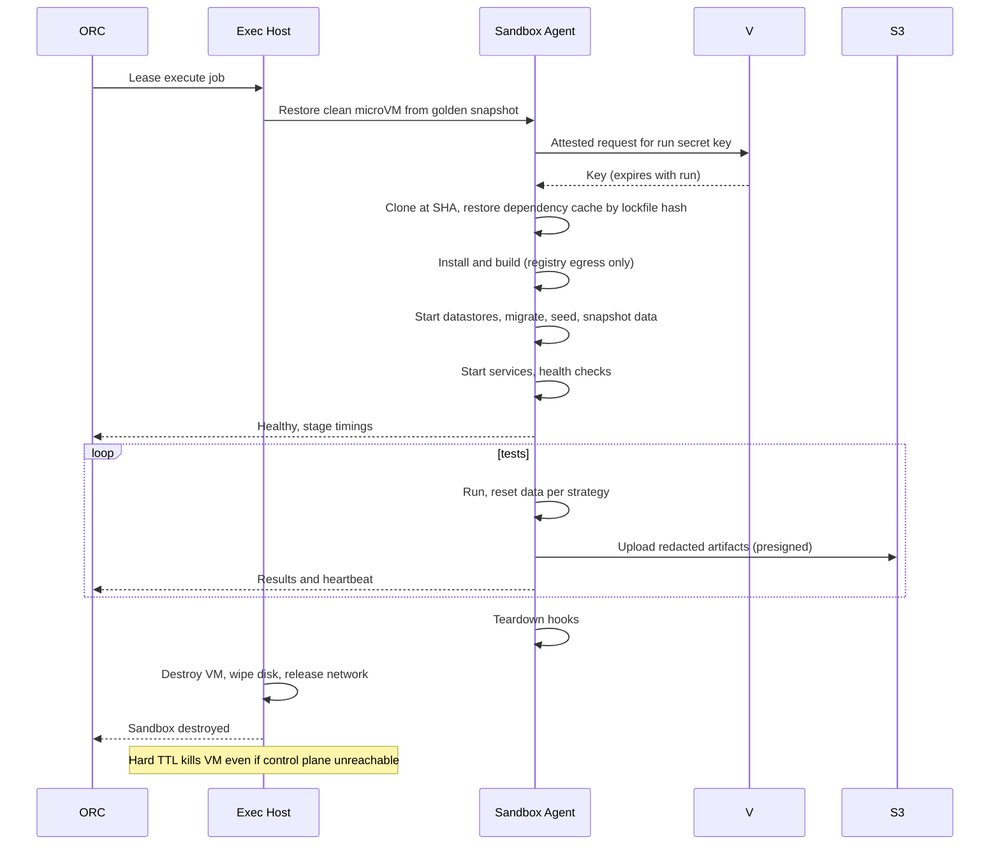
