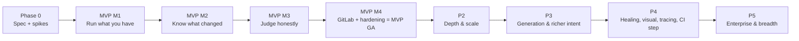
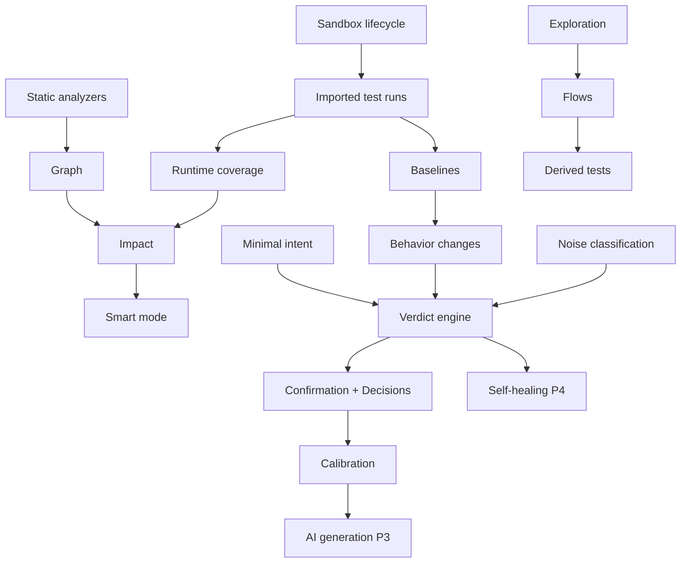

# 27 — Implementation Roadmap

**Purpose:** Revised phases with scope, exit criteria, and dependencies.
**Related:** [26-mvp](./26-mvp.md), [28-risks-and-challenges](./28-risks-and-challenges.md), [29-open-questions](./29-open-questions.md)

## 1. Review of the brief's phases

The brief proposes 11 phases (0–10) ordered by component: platform → ingestion → runtime → graph → generation → intent → regression → healing → scale → advanced. Problems:

1. **No usable product until ~Phase 7.** Each phase builds a component; the end-to-end loop (trigger → run → verdict → feedback) only closes late, so real-world validation arrives late.
2. **Intent Brain at Phase 6** is too late — verdict classification is needed as soon as behavior changes are detected (see [09-intent-brain](./09-intent-brain.md) §1).
3. **Test generation before intent** means generated tests would lack a trustworthy oracle.
4. **Sandbox startup** (the biggest onboarding risk) is buried inside Phase 3 rather than de-risked first.

**Revised approach:** vertical slices. Each milestone closes the loop end-to-end for real users, and adds intelligence incrementally. Test generation moves *after* intent and memory are proven.

## 2. Phases

### Phase 0 — Specification & de-risking spikes
**Scope:** this document set approved; critical decisions made (see [30](./30-architecture-review.md) §6); spikes:
- S1 **Sandbox startup**: auto-detect + start 10 real open-source TS apps (compose and scripts) in microVM and in pooled VM; measure time and success.
- S2 **Analyzer**: TS/Next/Nest/Express route + endpoint + call graph extraction on 3 repos; measure accuracy and graph size.
- S3 **Fingerprinting**: SPA state fingerprint stability across runs on 3 apps.
- S4 **Imported Playwright overlay**: run 3 existing suites with injected reporter/trace config.
**Exit:** decisions signed off; spike reports with measured numbers replacing hypotheses in 04/17.

### MVP M1 — "Run what you have" (first closed loop)
**Scope:** auth/orgs/projects; GitHub App + webhooks; TriggerRules; env detect+confirm (deterministic detector); vault; microVM sandbox lifecycle with egress proxy; run **imported Playwright tests** with evidence; basic noise classification (infra, retry-flaky); baselines on main (assertion-level); check + sticky comment; dashboard run view + evidence viewer; audit log; budgets (compute).
**Exit:** 3 design partners get PR checks on real PRs; A2, A8, A9 met; stage timings measured.
**Value:** "Your existing E2E suite on every PR, in isolation, with great evidence" — already useful.

### MVP M2 — "Know what changed"
**Scope:** Analysis Tier with TS/JS analyzers; Application Graph static layer + snapshots; runtime coverage mapping from test runs; network-based UI→API linkage; onboarding + targeted heuristic exploration; Flows (discovered/proposed); change impact + Smart/Quick/Full/Manual modes with explanations; shadow full run; derived tests (flow replay, auth matrix, OpenAPI contract).
**Exit:** A3, A4 met on reference apps + partners.

### MVP M3 — "Judge honestly"
**Scope:** behavior-change dimensions; third-party attribution via egress; test-defect classification; minimal Intent Brain (PR/commit extraction, existing tests, OpenAPI, implicit claims, manual claims); developer confirmation UX + comment commands; Decisions; verdict engine with confidence + calibration; AI gateway + failure diagnosis + eval suite; finding grouping/dedupe.
**Exit:** A5, A6, A7 met; eval suite gating in CI.

### MVP M4 — GitLab + hardening → **MVP GA**
**Scope:** GitLab provider; security review + external pen test; tenancy test suite; retention/deletion; runbooks; onboarding polish; cost reporting.
**Exit:** all [26-mvp](./26-mvp.md) §5 criteria; SEC-* MVP items closed.

### Phase 2 — Depth & scale
`.autoqa.yml`; plan sharding across sandboxes; multi-browser; AI-ranked exploration; negative form fills; DB-constraint & security-config intent; DSL → `.spec.ts` export; Slack/email; quality trend dashboards; warm-pool snapshot restore optimization; flaky-cause summaries.

### Phase 3 — Generation & richer intent
AI-generated tests (advisory → accepted); negative/boundary/UI derivations; ticket + requirement-doc ingestion; plan re-ranking; Cypress import; OAuth mock IdP; record/replay for external APIs; IDOR checks; multi-repo projects; SSO/SAML.

### Phase 4 — Healing, visual, tracing, CI step
Self-healing proposals; visual regression + AI explanation; OpenTelemetry backend tracing in sandbox; CI step/CLI + staging/preview URL mode with ownership verification; opt-in PRs that add tests to repo; browser/app split for scale.

### Phase 5 — Enterprise & breadth
Multi-region cells, data residency; dedicated execution pools; self-hosted runner in customer VPC; Python/Go/Java analyzers; Figma intent; IDE/local CLI; Kubernetes-based app stacks.

## 3. Dependency map

## 4. Team shape (indicative)
MVP with ~6–8 engineers: 2 execution plane/infra, 2 analysis + graph + impact, 1–2 control plane/API/integrations, 1 dashboard/UX, 1 AI/verdict engine (shared). Security review externally at M4.

Durations are intentionally not given until Phase 0 spikes provide data; estimating before S1 (sandbox startup) is measured would be speculative.
